# BÁO CÁO ĐỀ TÀI
HỆ THỐNG QUẢN LÝ CHUỖI CỬA HÀNG GIẶT LÀ / GIẶT SẤY TỰ ĐỘNG (BUBBLEFLOW)

---

# Chương 1: Tổng quan về đề tài

## 1.1. Lý do chọn đề tài
Trong kỷ nguyên hiện đại, sự phát triển nhanh chóng của các đô thị lớn cùng với lối sống bận rộn đã thúc đẩy nhu cầu sử dụng các dịch vụ tiện ích gia đình tăng cao. Trong đó, dịch vụ giặt là và giặt sấy tự động đã và đang trở thành một phần thiết yếu đối với người dân đô thị, học sinh, sinh viên và những người đi làm có quỹ thời gian hạn hẹp. 

Tuy nhiên, phần lớn các cửa hàng giặt là hiện nay tại Việt Nam vẫn đang vận hành theo các phương thức truyền thống:
* **Ghi chép thủ công hoặc phần mềm đơn giản**: Thông tin đơn hàng, cân nặng, gói dịch vụ thường được ghi tay hoặc lưu trên các bảng tính Excel rời rạc. Điều này dễ dẫn đến sai sót, nhầm lẫn thông tin khách hàng, nhầm lẫn giữa các gói dịch vụ (giặt sấy tiêu chuẩn, giặt nhanh, giặt khô cao cấp).
* **Thất lạc hoặc lẫn lộn đồ của khách**: Đây là vấn đề nhức nhối nhất trong ngành giặt là. Việc gom chung nhiều đơn hàng không được gán nhãn mã vạch hoặc mã giỏ đồ rõ ràng dẫn đến tình trạng trả nhầm đồ hoặc mất mát tài sản của khách.
* **Lãng phí công suất máy móc**: Không có công cụ theo dõi trạng thái máy giặt/máy sấy trong thời gian thực (real-time). Nhân viên không biết máy nào đang chạy, máy nào đang rảnh hoặc đang hỏng để điều phối giỏ đồ hợp lý, gây tắc nghẽn vào giờ cao điểm.
* **Vi phạm thời gian cam kết trả hàng (SLA)**: Khách hàng thường yêu cầu lấy đồ đúng hẹn (đặc biệt là dịch vụ giặt nhanh). Thiếu đi hệ thống cảnh báo tự động khi đơn hàng bị nghẽn ở các khâu (như phân loại quá lâu, sấy xong chưa xếp vào kệ) dẫn đến trễ hẹn trả đồ, giảm uy tín thương hiệu.

Nhận thấy các thách thức thực tế trên, đề tài **"Xây dựng Hệ thống Quản lý Chuỗi Cửa Hàng Giặt Là / Giặt Sấy Tự Động (BubbleFlow)"** được lựa chọn nghiên cứu và phát triển nhằm số hóa toàn diện quy trình vận hành cửa hàng, tối ưu hóa điều phối thiết bị và đảm bảo chất lượng dịch vụ cam kết với khách hàng.

---

## 1.2. Mục tiêu đề tài
Đề tài hướng tới nghiên cứu và xây dựng một giải pháp phần mềm toàn diện đạt được các mục tiêu cụ thể sau:
1. **Số hóa quy trình tiếp nhận & thanh toán**: Xây dựng phân hệ tiếp nhận đơn hàng nhanh chóng, tự động tính phí dựa trên cân nặng hoặc số lượng món đồ, hỗ trợ in hóa đơn nhiệt/biên nhận tạm thời chứa mã vạch định danh đơn hàng.
2. **Quản lý & Giám sát thiết bị thời gian thực**: Thiết lập màn hình giám sát trạng thái hoạt động (Rảnh, Đang chạy, Bảo trì, Lỗi) của toàn bộ hệ thống máy giặt/máy sấy dưới dạng lưới trực quan giúp nhân viên dễ dàng phân phối lồng giặt.
3. **Kiểm soát chặt chẽ vòng đời đơn hàng**: Áp dụng mô hình máy trạng thái (State Machine) để quản lý luồng trạng thái nghiêm ngặt từ: *Tiếp nhận (RECEIVED)* $\rightarrow$ *Phân loại (SORTING)* $\rightarrow$ *Đang giặt (WASHING)* $\rightarrow$ *Đang sấy (DRYING)* $\rightarrow$ *Chờ nhận (AWAITING_DELIVERY)* $\rightarrow$ *Hoàn thành (COMPLETED)*, đảm bảo tính nhất quán của dữ liệu.
4. **Giám sát cam kết dịch vụ (SLA Alerts)**: Tự động đo lường thời gian xử lý ở từng bước trạng thái và phát tín hiệu cảnh báo trực quan (nhấp nháy đèn còi 🚨) khi có đơn hàng bị tồn đọng quá hạn quy định, giúp nhân viên xử lý kịp thời.
5. **Phân quyền và bảo mật nâng cao (Dynamic RBAC)**: Triển khai cơ chế phân quyền động dựa trên vai trò (Role-Based Access Control) tự động đồng bộ hóa APIs của backend và phân quyền hiển thị giao diện phía khách (Frontend), nâng cao độ an toàn thông tin cho toàn hệ thống.

---

## 1.3. Đối tượng và Phạm vi nghiên cứu
### 1.3.1. Đối tượng nghiên cứu
* Quy trình nghiệp vụ tiếp nhận đồ, phân loại đồ, tính toán đơn giá dịch vụ giặt sấy/giặt khô.
* Quy trình điều phối lồng giặt/sấy và quản lý vòng đời hoạt động của các thiết bị máy giặt/sấy công nghiệp.
* Quy trình kiểm soát thời gian xử lý đơn hàng và cơ chế phát hiện cảnh báo vi phạm SLA.
* Kiến trúc phần mềm phân lớp, cơ chế xác thực bảo mật JWT kết hợp phân quyền động Dynamic Security trong Spring Security.

### 1.3.2. Phạm vi nghiên cứu
* **Về mặt chức năng**: Tập trung xây dựng các phân hệ cốt lõi phục vụ vận hành nội bộ cửa hàng giặt là bao gồm: Quản lý người dùng & phân quyền; Quản lý danh mục dịch vụ & thiết bị; Tiếp nhận đơn hàng & in biên nhận; Điều phối đơn hàng vào thiết bị; Máy trạng thái vòng đời đơn hàng & Cảnh báo SLA; Dashboard thống kê doanh thu và tải trọng máy móc.
* **Về mặt công nghệ**: Phát triển ứng dụng Web App trên nền tảng Spring Boot 3.5.3 (Java 21) cho Backend và React JS 18 (TypeScript, Ant Design, Tailwind CSS v4) cho Frontend, kết hợp hệ quản trị cơ sở dữ liệu PostgreSQL 16 và bộ đệm Redis 7.
* **Phạm vi triển khai**: Áp dụng thử nghiệm tại một cửa hàng hoặc chuỗi cửa hàng giặt là tự động quy mô vừa và nhỏ.

---

## 1.4. Cấu trúc của báo cáo
Nội dung báo cáo đề tài được chia bố cục thành 3 chương chính như sau:
* **Chương 1: Tổng quan về đề tài**: Giới thiệu lý do chọn đề tài, mục tiêu, đối tượng, phạm vi nghiên cứu và ý nghĩa thực tiễn của đề tài.
* **Chương 2: Phân tích yêu cầu và Thiết kế hệ thống**:
  * Trình bày các yêu cầu chức năng và phi chức năng của hệ thống.
  * Phân tích tác nhân (Actors) và xây dựng sơ đồ Use Case tổng thể cùng kịch bản đặc tả chi tiết các Use Case quan trọng.
  * Thiết kế động hệ thống thông qua các biểu đồ tuần tự (Sequence Diagram) cho các luồng xử lý chính.
  * Thiết kế tĩnh hệ thống qua biểu đồ lớp thực thể (Class Diagram) và sơ đồ quan hệ cơ sở dữ liệu (ERD).
* **Chương 3: Phát triển và Thử nghiệm hệ thống**:
  * Giới thiệu công nghệ phát triển, kiến trúc phân lớp của Backend và cấu trúc thư mục của Frontend.
  * Trình bày quá trình hiện thực hóa các chức năng cốt lõi kèm mã nguồn tiêu biểu và hình ảnh mô tả giao diện hệ thống.
  * Xây dựng kịch bản kiểm thử (Test Cases), đánh giá kết quả thử nghiệm hệ thống và rút ra kết luận, hướng phát triển tương lai của đề tài.


<div style="page-break-after: always;"></div>

# Chương 2: Phân tích yêu cầu và Thiết kế hệ thống

## 2.1. Phân tích yêu cầu hệ thống

Để xây dựng một hệ thống quản lý giặt sấy vận hành trơn tru, việc đầu tiên là xác định rõ ràng các nhóm tác nhân (Actors) tham gia vào hệ thống, từ đó đặc tả các yêu cầu chức năng (Functional Requirements) và phi chức năng (Non-functional Requirements) chi tiết.

### 2.1.1. Xác định các tác nhân (Actors)
Hệ thống **BubbleFlow** xác định 4 nhóm tác nhân chính tương tác trực tiếp hoặc gián tiếp:
1. **Khách hàng (Customer)**: Đối tượng thụ hưởng dịch vụ. Khách hàng trực tiếp mang đồ đến cửa hàng, cung cấp thông tin định danh (Họ tên, Số điện thoại) để hệ thống lưu trữ và theo dõi tích lũy đơn hàng.
2. **Nhân viên cửa hàng (Staff)**: Tác nhân vận hành cốt lõi tại cửa hàng. Staff thực hiện tiếp nhận đồ, cân ký, tạo đơn hàng trên phần mềm, phân loại đồ, gán giỏ đồ vào máy giặt/máy sấy, cập nhật trạng thái đơn hàng khi máy chạy xong, đóng gói và thực hiện bàn giao trả đồ, thu tiền của khách.
3. **Quản lý cửa hàng (Manager)**: Giám sát toàn bộ hoạt động kinh doanh tại cửa hàng. Manager có quyền quản lý danh mục dịch vụ (gói giặt sấy theo kg, giặt khô theo món), quản lý cấu hình danh sách máy móc, theo dõi hiệu suất làm việc của nhân viên, hiệu suất khai thác thiết bị và xem báo cáo doanh thu.
4. **Quản trị hệ thống (Admin)**: Người có quyền hạn cao nhất trong hệ thống. Admin chịu trách nhiệm khởi tạo tài khoản cho nhân viên, quản lý phân quyền chi tiết (Roles & Permissions), cấu hình hệ thống, và giám sát lịch sử hoạt động (Audit Logs).

---

### 2.1.2. Phân tích yêu cầu chức năng (Functional Requirements)
Yêu cầu chức năng của hệ thống được chia làm 5 phân hệ chính:

#### 1. Phân hệ Xác thực & Phân quyền (Authentication & RBAC)
* Hệ thống phải cho phép người dùng đăng nhập bằng Email và Mật khẩu.
* Hệ thống cấp phát cặp mã thông báo JWT (Access Token thời hạn ngắn 15 phút để bảo mật và Refresh Token thời hạn dài 7 ngày lưu trữ phiên đăng nhập).
* Hệ thống phải cung cấp cơ chế phân quyền động: tự động quét tất cả các API endpoints khi khởi động và cho phép Admin gán quyền truy cập API cụ thể cho từng Vai trò (Role) thông qua giao diện Checkbox trực quan.
* Giao diện người dùng (UI) tại Frontend phải tự động ẩn hoặc vô hiệu hóa các nút chức năng/menu dựa trên danh sách quyền hạn mà tài khoản đăng nhập sở hữu.

#### 2. Phân hệ Quản lý Danh mục (Master Data Management)
* **Quản lý Dịch vụ**: Cho phép Manager/Admin CRUD dịch vụ giặt là (mã dịch vụ, tên dịch vụ, đơn giá, đơn vị tính: KG/ITEM, mô tả).
* **Quản lý Thiết bị**: Cho phép Manager/Admin CRUD danh sách máy giặt và máy sấy (mã thiết bị, tên máy, loại máy: Máy giặt / Máy sấy, công suất: 9kg/11kg/15kg, trạng thái: IDLE, RUNNING, MAINTENANCE, OUT_OF_SERVICE).

#### 3. Phân hệ Tiếp nhận & Điều phối (Order Intake & Dispatching)
* **Tiếp nhận đơn hàng**: Staff nhập thông tin khách hàng, chọn các dịch vụ khách sử dụng, nhập số ký (đối với dịch vụ tính theo kg) hoặc số lượng món (đối với giặt hấp vest/giày). Hệ thống tự động tính tiền theo đơn giá gói dịch vụ và sinh mã đơn hàng duy nhất dưới dạng Barcode.
* **In biên nhận tạm thời**: Hệ thống hỗ trợ sinh hóa đơn biên nhận nhiệt (giao diện tối ưu hóa cho khổ giấy K80) để in và đưa cho khách hoặc đính kèm vào giỏ đồ.
* **Điều phối đơn hàng**: Staff gán mã giỏ đồ (`laundry_baskets`) vào đơn hàng, sau đó gán giỏ đồ này vào một máy giặt hoặc máy sấy đang ở trạng thái rảnh (`IDLE`). Hệ thống sẽ tự động chuyển trạng thái máy sang `RUNNING` và khóa giỏ đồ đó.

#### 4. Phân hệ Máy trạng thái & Giám sát SLA (State Machine & SLA Alerts)
* **Quản lý trạng thái**: Kiểm soát vòng đời đơn hàng đi qua đúng chuỗi trạng thái: `RECEIVED` $\rightarrow$ `SORTING` $\rightarrow$ `WASHING` $\rightarrow$ `DRYING` $\rightarrow$ `AWAITING_DELIVERY` $\rightarrow$ `COMPLETED`. Mỗi lần chuyển trạng thái phải được hệ thống ghi log chi tiết (thời gian, người thực hiện).
* **Giám sát SLA**: Hệ thống tự động cấu hình thời gian xử lý tối đa cho phép ở mỗi trạng thái (ví dụ: khâu giặt tối đa 90 phút, sấy tối đa 60 phút). Nếu đơn hàng ở một trạng thái quá thời gian cấu hình mà chưa chuyển bước, hệ thống phải kích hoạt cờ cảnh báo quá hạn.
* **Cảnh báo trực quan**: Trên màn hình điều hành, đơn hàng vi phạm SLA sẽ hiển thị biểu tượng nhấp nháy 🚨 màu đỏ và thanh tiến trình hiển thị rõ bước bị nghẽn.

#### 5. Phân hệ Thống kê & Dashboard
* Hiển thị tổng quan số lượng đơn hàng trong ngày, doanh thu tích lũy, số lượng máy đang hoạt động.
* Biểu đồ doanh thu theo thời gian và tỷ trọng dịch vụ sử dụng nhiều nhất.
* Biểu đồ giám sát công suất tải của máy móc trong ngày.

---

### 2.1.3. Phân tích yêu cầu phi chức năng (Non-functional Requirements)
* **Tính hiệu năng (Performance)**:
  * Thời gian phản hồi của các API nghiệp vụ chính (tạo đơn, điều phối máy) phải dưới 500ms trong điều kiện mạng bình thường.
  * Tận dụng bộ nhớ đệm Redis 7 để lưu trữ các thông tin tĩnh như danh mục dịch vụ, quyền hạn người dùng để giảm tải cho cơ sở dữ liệu PostgreSQL.
  * Tích hợp Redis để làm bộ đếm doanh thu real-time trên Dashboard.
* **Tính bảo mật (Security)**:
  * Toàn bộ mật khẩu của người dùng phải được băm bằng thuật toán mã hóa mạnh **BCrypt** trước khi lưu vào cơ sở dữ liệu.
  * Phòng chống các lỗ hổng bảo mật phổ biến như SQL Injection (thông qua Spring Data JPA/Hibernate sử dụng tham số hóa truy vấn), XSS, và CSRF.
  * Phân quyền bảo mật chặt chẽ ở mức phương thức (Method-level) và mức URL (Request-level) ở Backend, không cho phép bypass bằng cách đổi URL ở Client.
* **Tính sẵn sàng & Khả năng mở rộng (Availability & Scalability)**:
  * Hệ thống có khả năng hoạt động ổn định liên tục 24/7.
  * Thiết kế cơ sở dữ liệu chuẩn hóa, đánh chỉ mục (Index) đầy đủ trên các cột khóa ngoại và các cột thường xuyên tìm kiếm (Email, Order Code, Status, Device Code) giúp truy vấn nhanh chóng khi dữ liệu lên tới hàng triệu bản ghi.
  * Triển khai dễ dàng bằng Docker Container giúp mở rộng quy mô (Scale out) Backend khi tải trọng tăng cao.

---

### 2.1.4. Biểu đồ Use Case tổng thể hệ thống
Dưới đây là sơ đồ Use Case tổng thể của hệ thống BubbleFlow, thể hiện các chức năng chính và các tác nhân tương tác:

#### Hình ảnh trực quan sơ đồ Use Case:
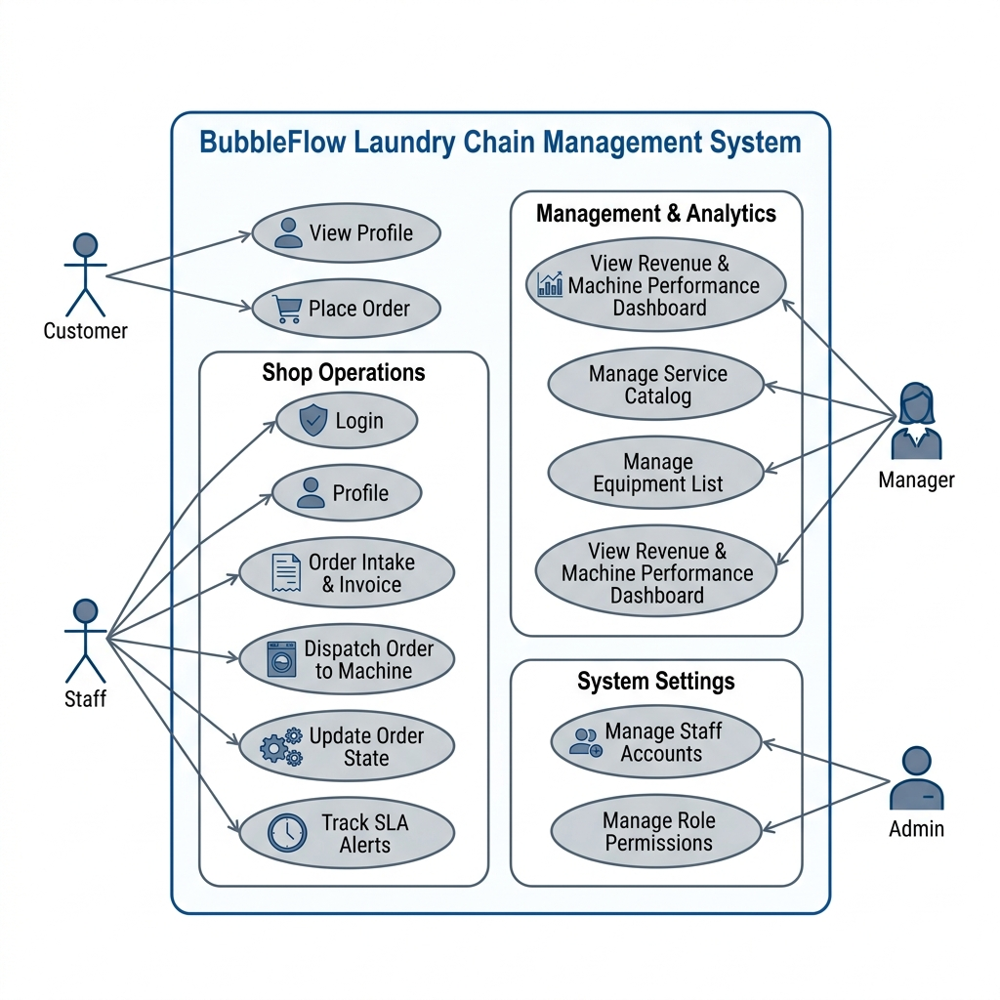


<div style="page-break-after: always;"></div>

# Chương 2 (Tiếp theo)

## 2.2. Kịch bản đặc tả Use Case chi tiết

Để làm sáng tỏ luồng nghiệp vụ hoạt động của hệ thống BubbleFlow, dưới đây là đặc tả chi tiết (Use Case Scenarios) của 4 Use Case cốt lõi:

---

### 2.2.1. Kịch bản Use Case 1: Tiếp nhận đơn hàng (Order Intake)

#### Minh họa giao diện Tiếp nhận đơn hàng:
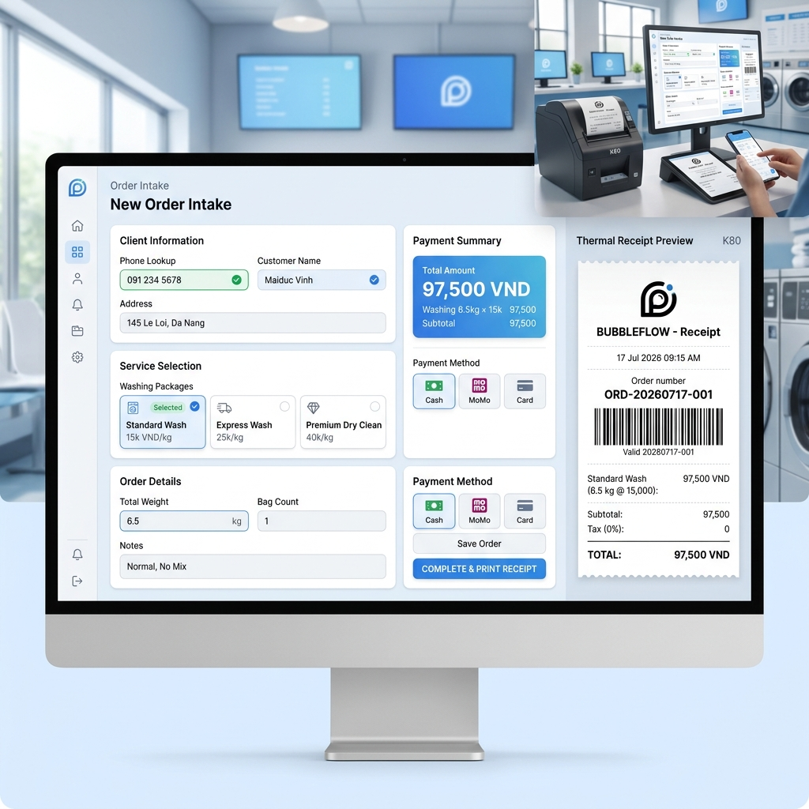

* **Tên Use Case**: Tiếp nhận đơn hàng & Cân ký tự động
* **Mã Use Case**: UC_01
* **Tác nhân chính**: Nhân viên cửa hàng (Staff)
* **Tác nhân phụ**: Khách hàng (Customer)
* **Mô tả**: Nhân viên tiếp nhận đồ bẩn từ khách hàng, phân loại đồ, cân trọng lượng đồ hoặc đếm số lượng món đồ, chọn gói dịch vụ tương ứng trên hệ thống, nhập thông tin khách hàng và hoàn tất tạo đơn. Hệ thống tự động tính tiền và sinh mã đơn hàng để in hóa đơn nhiệt.
* **Tiền điều kiện**: 
  * Nhân viên cửa hàng đã đăng nhập thành công vào hệ thống.
  * Danh mục dịch vụ và bảng giá đã được thiết lập sẵn trên cơ sở dữ liệu.
* **Hậu điều kiện**: 
  * Đơn hàng được tạo thành công với trạng thái ban đầu là `RECEIVED`.
  * Hóa đơn tạm thời (biên nhận) được hiển thị dạng bản in nhiệt để nhân viên in ra đính kèm vào giỏ đồ.
  
#### Luồng sự kiện chính (Basic Flow)
1. Khách hàng mang đồ đến quầy giao dịch.
2. Nhân viên mở màn hình **Tiếp nhận đơn hàng (Order Intake)**.
3. Nhân viên nhập thông tin định danh khách hàng (Số điện thoại và Họ tên). Hệ thống tự động kiểm tra xem khách hàng đã tồn tại chưa:
   * Nếu đã tồn tại: Hệ thống tự động điền họ tên khách hàng.
   * Nếu chưa tồn tại: Nhân viên nhập mới họ tên khách hàng.
4. Nhân viên chọn loại dịch vụ từ danh sách (ví dụ: Giặt sấy tiêu chuẩn, Giặt sấy nhanh, Giặt khô áo vest...).
5. Nhân viên cân đồ (hoặc đếm số lượng món đồ) rồi nhập số liệu vào hệ thống (ví dụ: 8.5 kg hoặc 2 cái áo vest).
6. Hệ thống tự động tính tổng tiền dựa trên công thức: $\text{Tổng tiền} = \text{Số lượng (hoặc số kg)} \times \text{Đơn giá dịch vụ}$.
7. Nhân viên nhập ghi chú của đơn hàng (nếu có, ví dụ: đồ lụa giặt riêng, giày rách nhẹ đế...).
8. Nhân viên nhấn nút **Tạo Đơn Hàng**.
9. Hệ thống lưu đơn hàng vào Cơ sở dữ liệu, sinh mã đơn hàng độc nhất (Ví dụ: `ORD-20260715-001`) và tự động hiển thị popup in hóa đơn nhiệt có chứa mã vạch đơn hàng.
10. Nhân viên in hóa đơn, giao một bản cho khách và đính kèm bản còn lại vào giỏ đồ bẩn.

#### Luồng sự kiện thay thế & Ngoại lệ
* **Thay thế 3a (Thông tin khách hàng bị thiếu)**: Nhân viên chỉ cần nhập số điện thoại khách hàng, tên khách hàng có thể nhập là "Khách vãng lai" nếu khách không muốn để lại họ tên thật.
* **Ngoại lệ 6a (Không hợp lệ số lượng/số cân)**: Số cân nặng hoặc số lượng món đồ nhập vào là số âm hoặc bằng 0. Hệ thống hiển thị thông báo lỗi và yêu cầu nhân viên nhập lại giá trị hợp lệ lớn hơn 0 trước khi cho phép tạo đơn.

---

### 2.2.2. Kịch bản Use Case 2: Điều phối & Gán lồng giặt (Dispatching)

#### Minh họa giao diện Điều phối thiết bị:
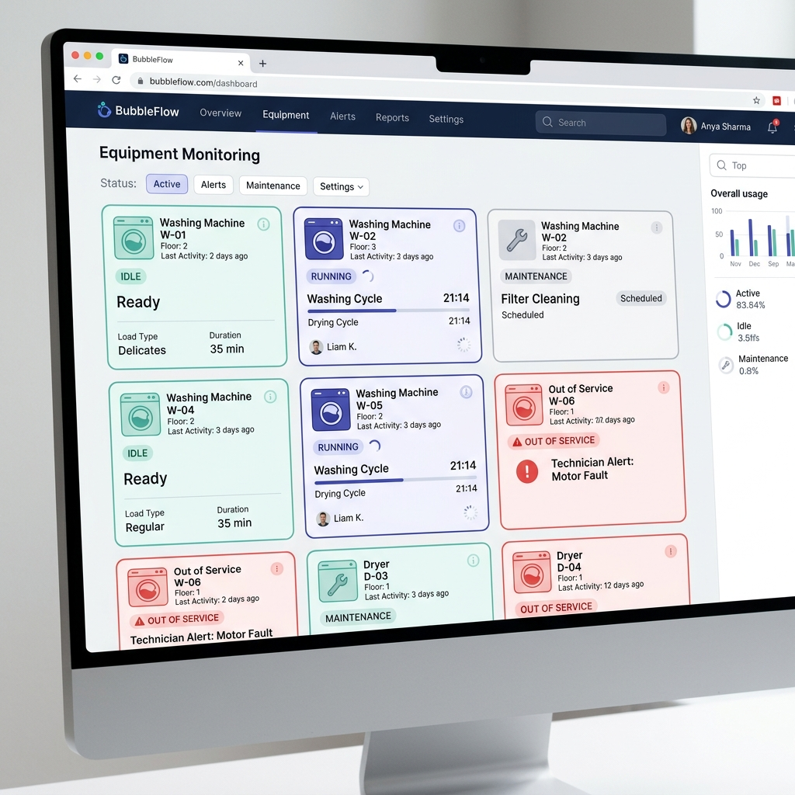

* **Tên Use Case**: Điều phối & Gán lồng giặt vào máy
* **Mã Use Case**: UC_02
* **Tác nhân chính**: Nhân viên cửa hàng (Staff)
* **Mô tả**: Nhân viên gán mã giỏ đồ (lồng giặt) chứa đồ của khách vào một thiết bị (máy giặt hoặc máy sấy) đang rảnh để bắt đầu quá trình giặt/sấy.
* **Tiền điều kiện**: 
  * Đơn hàng đang ở trạng thái `RECEIVED` hoặc `SORTING`.
  * Có ít nhất một giỏ đồ (`laundry_baskets`) ở trạng thái rảnh (`IDLE`).
  * Có ít nhất một máy giặt/máy sấy (`equipments`) ở trạng thái rảnh (`IDLE`).
* **Hậu điều kiện**: 
  * Giỏ đồ được liên kết với đơn hàng và máy giặt/sấy cụ thể.
  * Trạng thái máy giặt/sấy chuyển từ `IDLE` sang `RUNNING`.
  * Trạng thái giỏ đồ chuyển từ `IDLE` sang `USING`.
  * Trạng thái đơn hàng chuyển sang `WASHING` (nếu gán vào máy giặt) hoặc `DRYING` (nếu gán vào máy sấy).

#### Luồng sự kiện chính (Basic Flow)
1. Nhân viên truy cập màn hình **Điều phối đơn hàng (Order Dispatching)**.
2. Hệ thống hiển thị danh sách đơn hàng đang chờ xử lý và lưới trạng thái hoạt động của các máy.
3. Nhân viên chọn một đơn hàng cần xử lý.
4. Nhân viên chọn một Giỏ đồ trống (ví dụ: `BSK_01 - Giỏ đồ xanh A`).
5. Nhân viên chọn một Máy giặt đang rảnh (ví dụ: `WASH_01 - Máy giặt Electrolux 11kg A`).
6. Nhân viên nhấn nút **Bắt đầu Giặt**.
7. Hệ thống xác nhận và thực hiện các cập nhật sau trong một Transaction:
   * Gán `order_id` và `equipment_id` vào giỏ đồ `BSK_01`.
   * Cập nhật trạng thái giỏ đồ `BSK_01` thành `USING`.
   * Cập nhật trạng thái máy `WASH_01` thành `RUNNING`.
   * Chuyển trạng thái đơn hàng sang `WASHING`.
   * Ghi nhận lịch sử chuyển đổi trạng thái đơn hàng vào bảng `order_state_logs`.
8. Hệ thống cập nhật giao diện thời gian thực (real-time grid) để phản ánh máy `WASH_01` đang hoạt động.

#### Luồng sự kiện thay thế & Ngoại lệ
* **Ngoại lệ 5a (Máy bị lỗi đột ngột)**: Khi nhân viên chọn máy nhưng thiết bị đó vừa được Manager chuyển sang trạng thái `MAINTENANCE` hoặc `OUT_OF_SERVICE`. Hệ thống thông báo máy không khả dụng và yêu cầu chọn máy khác.
* **Ngoại lệ 7a (Quá tải công suất máy)**: Cân nặng của đơn hàng vượt quá công suất định mức của máy (Ví dụ đơn hàng 13kg nhưng gán vào máy sấy 9kg). Hệ thống sẽ đưa ra cảnh báo nhắc nhở nhân viên xác nhận xem có muốn chia nhỏ đồ hoặc đổi sang máy công suất lớn hơn không.

---

### 2.2.3. Kịch bản Use Case 3: Theo dõi & Chuyển trạng thái đơn hàng (State Transition)

* **Tên Use Case**: Theo dõi & Chuyển trạng thái đơn hàng
* **Mã Use Case**: UC_03
* **Tác nhân chính**: Hệ thống (System), Nhân viên cửa hàng (Staff)
* **Mô tả**: Vòng đời của một đơn hàng được kiểm soát nghiêm ngặt bằng cơ chế Spring Statemachine thông qua các trạng thái tuần tự nhằm đảm bảo không có khâu nào bị bỏ sót và thông tin luôn đồng bộ.
* **Tiền điều kiện**: 
  * Đơn hàng đã được khởi tạo trong hệ thống.
* **Hậu điều kiện**: 
  * Trạng thái của đơn hàng được chuyển dịch chính xác sang bước tiếp theo.
  * Bản ghi lịch sử đổi trạng thái được ghi vào cơ sở dữ liệu để phục vụ kiểm toán và tính toán SLA.

#### Luồng sự kiện chính (Basic Flow)
1. Đơn hàng mới được tạo thành công mặc định nhận trạng thái `RECEIVED`.
2. Nhân viên tiến hành phân loại đồ của khách (ví dụ tách đồ màu, đồ trắng, đồ chất liệu đặc biệt), bấm chọn chuyển trạng thái đơn hàng sang `SORTING`.
3. Khi nhân viên điều phối gán giỏ đồ của đơn hàng vào máy giặt và khởi động máy (xem UC_02), hệ thống tự động chuyển trạng thái đơn hàng sang `WASHING`.
4. Sau khi máy giặt chạy xong, nhân viên lấy đồ ra, chuyển đồ vào máy sấy và gán thiết bị sấy, hệ thống tự động chuyển trạng thái đơn hàng sang `DRYING`.
5. Khi máy sấy hoàn thành chu kỳ sấy, nhân viên lấy đồ ra, tiến hành gấp gọn gàng, đóng túi nilon và xếp lên kệ chờ giao trả. Nhân viên bấm xác nhận hoàn thành xử lý, hệ thống tự động chuyển trạng thái đơn hàng sang `AWAITING_DELIVERY`.
6. Khách hàng đến nhận đồ hoặc shipper đến lấy đồ giao đi, nhân viên xác nhận thanh toán (nếu chưa thanh toán trước đó) và bấm trả hàng, hệ thống chuyển trạng thái đơn hàng sang `COMPLETED`.

#### Luồng sự kiện thay thế & Ngoại lệ
* **Ngoại lệ (Chuyển trạng thái không hợp lệ)**: Nhân viên cố tình thao tác bỏ qua các khâu (ví dụ chuyển thẳng từ `RECEIVED` sang `DRYING` mà không qua `WASHING`). Cơ chế Spring Statemachine ở Backend sẽ chặn hành động này, từ chối cập nhật cơ sở dữ liệu và throw ra `BusinessException` với thông báo "Trạng thái chuyển đổi không hợp lệ".

---

### 2.2.4. Kịch bản Use Case 4: Giám sát & Cảnh báo vi phạm SLA (SLA Alerting)

#### Minh họa giao diện Cảnh báo SLA trễ hạn:


* **Tên Use Case**: Giám sát & Cảnh báo vi phạm SLA
* **Mã Use Case**: UC_04
* **Tác nhân chính**: Hệ thống (Tự động chạy ngầm - Background Service)
* **Tác nhân phụ**: Nhân viên cửa hàng (Staff)
* **Mô tả**: Hệ thống tự động quét và tính toán thời gian tồn đọng của từng đơn hàng tại mỗi khâu trạng thái. Nếu vượt quá giới hạn SLA cấu hình, hệ thống sẽ kích hoạt trạng thái cảnh báo vi phạm để nhân viên lập tức xử lý đơn hàng bị chậm trễ.
* **Tiền điều kiện**: 
  * Cấu hình thời gian SLA cho từng trạng thái được thiết lập trong cài đặt hệ thống (Ví dụ: `SORTING` tối đa 30 phút, `WASHING` tối đa 90 phút, `DRYING` tối đa 60 phút).
* **Hậu điều kiện**: 
  * Các đơn hàng quá hạn SLA bị gắn cờ cảnh báo quá hạn.
  * Hiển thị cảnh báo trực quan trên giao diện màn hình điều hành.

#### Luồng sự kiện chính (Basic Flow)
1. Định kỳ mỗi 30 giây, một tác vụ ngầm chạy tự động (Scheduled Task) ở Backend kích hoạt.
2. Tác vụ ngầm truy vấn tất cả các đơn hàng chưa hoàn thành (trạng thái khác `COMPLETED`).
3. Đối với mỗi đơn hàng, hệ thống lấy mốc thời gian chuyển vào trạng thái hiện tại từ bảng `order_state_logs`.
4. Hệ thống so sánh: $\text{Thời gian đã trôi qua} = \text{Thời gian hiện tại} - \text{Thời gian chuyển trạng thái gần nhất}$.
5. Hệ thống đối chiếu với cấu hình SLA của trạng thái hiện tại:
   * Nếu $\text{Thời gian đã trôi qua} > \text{Thời gian SLA cấu hình}$, hệ thống đánh dấu đơn hàng này là **Vi phạm SLA (SLA Breached)**.
6. Backend trả về thông tin vi phạm SLA thông qua API danh sách đơn hàng.
7. Màn hình quản lý tại Frontend (được cập nhật liên tục) nhận diện cờ vi phạm SLA của đơn hàng:
   * Kích hoạt còi báo động đỏ nhấp nháy 🚨 bên cạnh mã đơn hàng.
   * Tô màu đỏ dòng đơn hàng bị vi phạm.
   * Hiển thị thời gian đã quá hạn (Ví dụ: "Quá hạn 15 phút").
8. Nhân viên nhìn thấy cảnh báo và ưu tiên xử lý đơn hàng bị tồn đọng này trước.

#### Luồng sự kiện thay thế & Ngoại lệ
* **Thay thế (Xử lý giải tỏa cảnh báo)**: Ngay sau khi nhân viên thao tác chuyển đơn hàng sang trạng thái tiếp theo, cờ vi phạm SLA tại trạng thái cũ tự động biến mất và bộ đếm thời gian SLA cho trạng thái mới bắt đầu chạy lại từ 0.


<div style="page-break-after: always;"></div>

# Chương 2 (Tiếp theo)

## 2.3. Thiết kế Động - Biểu đồ tuần tự (Sequence Diagrams)

Để mô tả sự tương tác động giữa các thành phần trong hệ thống (Frontend, Security Filter, Controllers, Services, Repositories và Database), phần này thiết lập 4 biểu đồ tuần tự cho các luồng nghiệp vụ cốt lõi bằng cú pháp Mermaid.

---

### 2.3.1. Biểu đồ tuần tự luồng Đăng nhập & Phân quyền động (Dynamic RBAC)

Luồng đăng nhập thực hiện xác thực người dùng, cấp Access Token/Refresh Token. Sau đó, mỗi khi có yêu cầu gọi API, bộ lọc `Dynamic AuthorizationManager` của Spring Security sẽ kiểm tra quyền truy cập động bằng cách đối chiếu thông tin yêu cầu với dữ liệu quyền của người dùng trong cơ sở dữ liệu.

#### Hình ảnh trực quan biểu đồ tuần tự Đăng nhập & RBAC động:
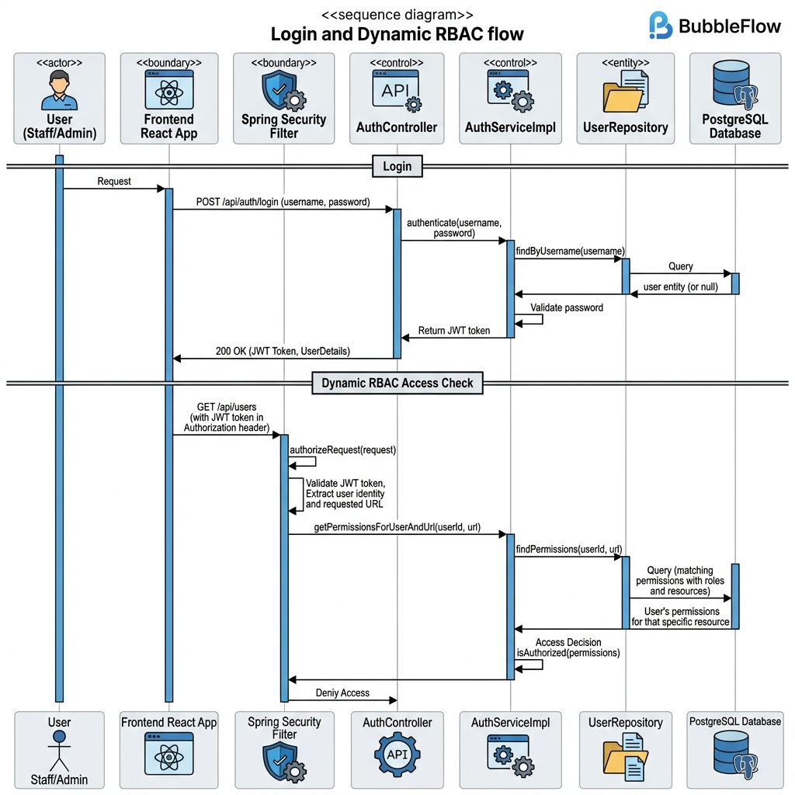

---

### 2.3.2. Biểu đồ tuần tự luồng Tiếp nhận đơn hàng & Tính giá tự động

Khi nhân viên tiếp nhận đồ bẩn, nhập cân nặng hoặc số lượng món, hệ thống tự động gọi dữ liệu bảng giá dịch vụ để tính tiền và lưu trữ đơn hàng.

#### Hình ảnh trực quan biểu đồ tuần tự Tiếp nhận & Tính giá:
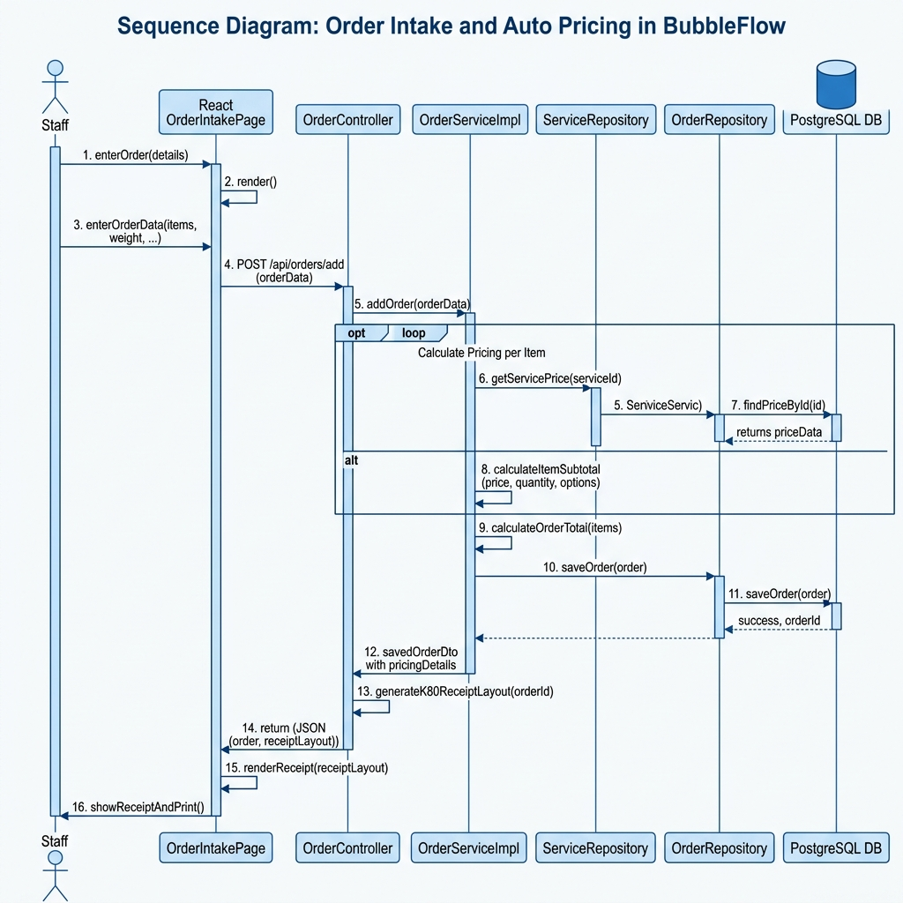

---

### 2.3.3. Biểu đồ tuần tự luồng Điều phối & Gán giỏ đồ vào máy chạy

Quy trình nhân viên gán giỏ đồ của đơn hàng vào một máy giặt/máy sấy đang rảnh. Trạng thái máy được cập nhật thời gian thực và Spring Statemachine kiểm soát việc chuyển đổi trạng thái của đơn hàng.

#### Hình ảnh trực quan biểu đồ tuần tự Điều phối & Gán máy:
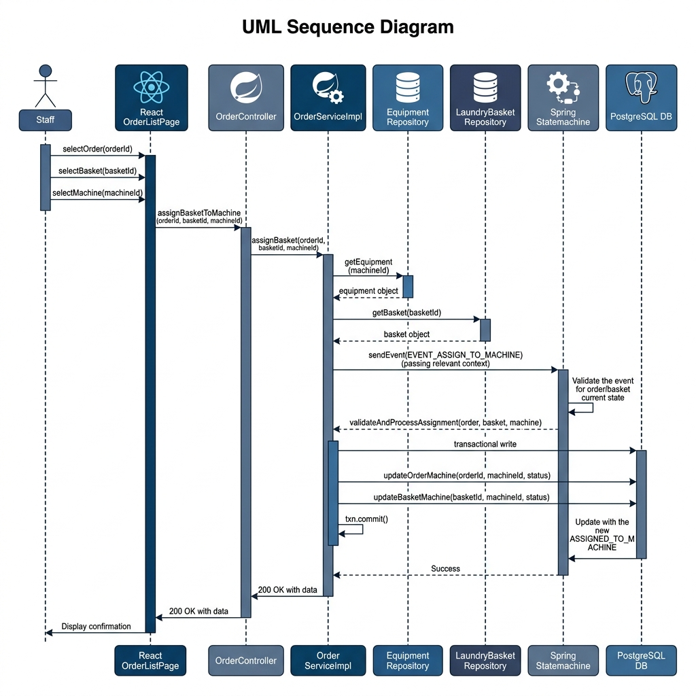

---

### 2.3.4. Biểu đồ tuần tự luồng Tác vụ ngầm quét và phát hiện vi phạm SLA

Luồng tự động chạy ngầm dưới nền của máy chủ (Background Job) để phát hiện trễ hẹn ở từng trạng thái xử lý đơn hàng.

#### Hình ảnh trực quan biểu đồ tuần tự Quét SLA:
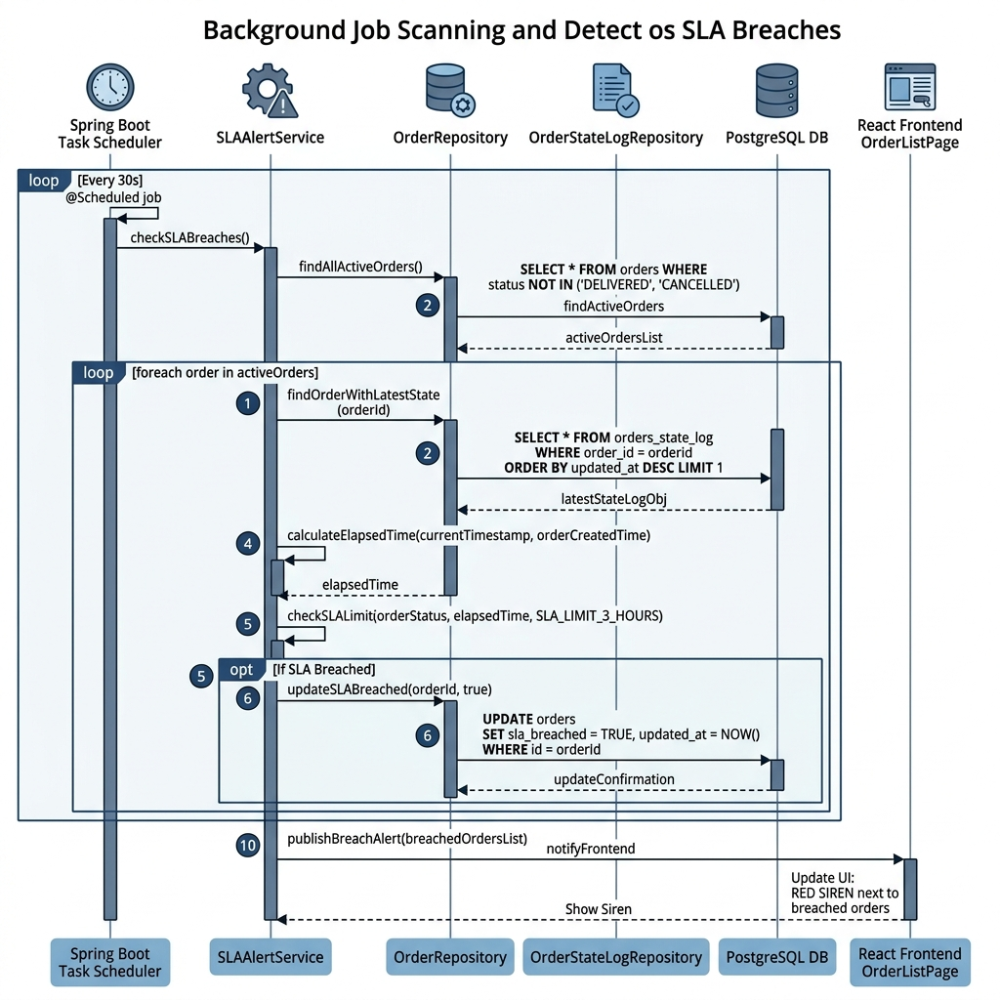


<div style="page-break-after: always;"></div>

# Chương 2 (Tiếp theo)

## 2.4. Thiết kế Tĩnh - Biểu đồ lớp & Sơ đồ CSDL (ERD)

Thiết kế tĩnh của hệ thống BubbleFlow tập trung vào việc mô tả cấu trúc lưu trữ dữ liệu dưới cơ sở dữ liệu vật lý (ERD) và cấu trúc lớp đối tượng Java ở mức thực thể (Entity Class Diagram) ánh xạ trực tiếp bằng Hibernate/JPA.

---

### 2.4.1. Sơ đồ thực thể liên kết cơ sở dữ liệu (ERD)

Sơ đồ ERD dưới đây mô tả chi tiết các bảng, trường dữ liệu, khóa chính (PK), khóa ngoại (FK), kiểu dữ liệu và mối quan hệ giữa các bảng trong hệ quản trị cơ sở dữ liệu PostgreSQL.

#### Hình ảnh thực tế sơ đồ thực thể liên kết CSDL (ERD):
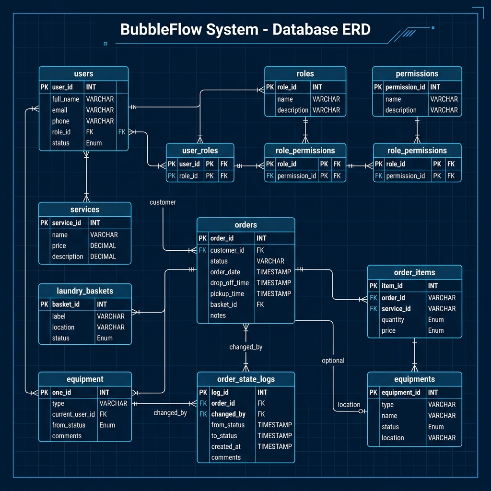

---

### 2.4.2. Biểu đồ lớp thực thể (Entity Class Diagram)

Các thực thể trong Java Backend đều kế thừa từ lớp cha `BaseEntity` (nơi định nghĩa các cột kiểm toán tự động như `created_at`, `updated_at`, `created_by`, `updated_by` và trường `version` phục vụ Khóa lạc quan - Optimistic Locking).

#### Hình ảnh thực tế biểu đồ lớp thực thể Java:
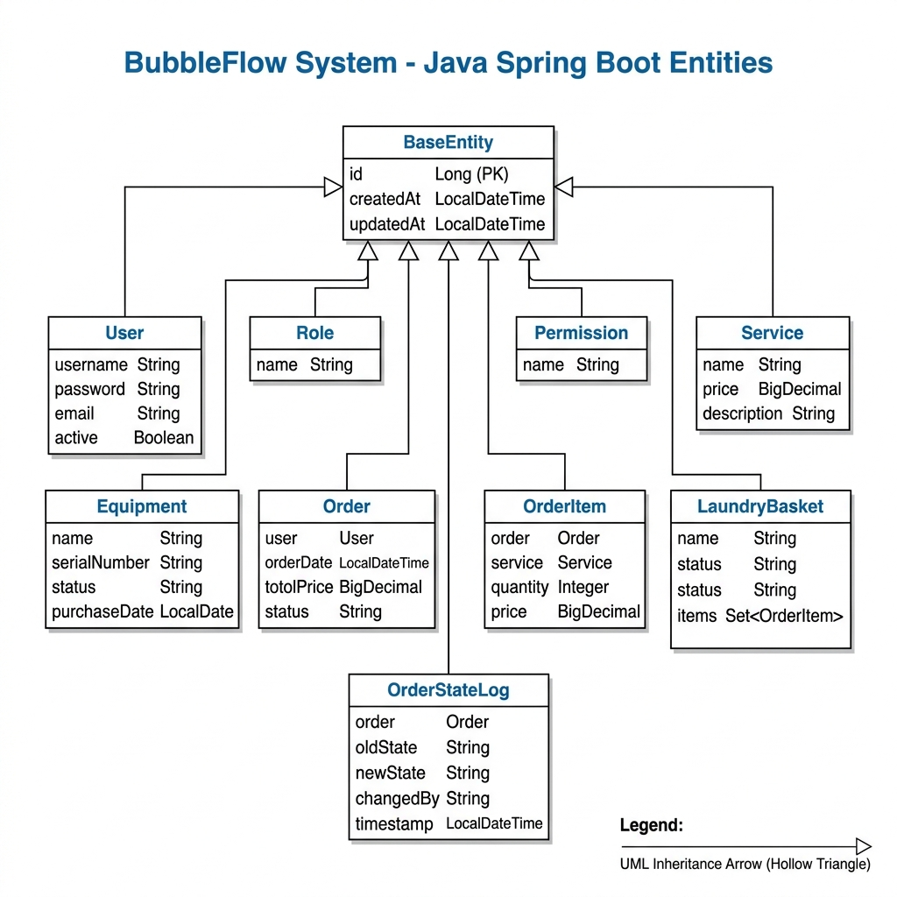


<div style="page-break-after: always;"></div>

# Chương 3: Phát triển và Thử nghiệm hệ thống

## 3.1. Kiến trúc và Công nghệ phát triển

Chương này trình bày chi tiết về việc lựa chọn công nghệ phát triển, thiết kế kiến trúc phân lớp của hệ thống **BubbleFlow** nhằm đáp ứng các yêu cầu nghiệp vụ phức tạp và hiệu suất vận hành cao của cửa hàng giặt sấy.

---

### 3.1.1. Công nghệ phát triển

Hệ thống được phát triển dựa trên mô hình Client-Server hiện đại, phân tách hoàn toàn giữa Frontend (giao diện người dùng) và Backend (xử lý nghiệp vụ & cơ sở dữ liệu), kết nối thông qua các giao thức RESTful APIs.

#### 1. Công nghệ Backend
* **Java 21 (LTS)**: Phiên bản Java dài hạn mới nhất mang lại hiệu năng tối ưu và hỗ trợ các tính năng ngôn ngữ hiện đại như: *Records* (cho các DTO bất biến), *Pattern Matching for switch*, *Virtual Threads* giúp hệ thống xử lý lượng lớn kết nối đồng thời dễ dàng hơn.
* **Spring Boot 3.5.3**: Khung ứng dụng chính cung cấp:
  * **Spring Data JPA & Hibernate**: Tự động hóa ánh xạ quan hệ thực thể, tối ưu hóa truy vấn thông qua cơ chế trì hoãn tải (Lazy Loading) và phân trang cưỡng chế (Pagination).
  * **Spring Security**: Triển khai cơ chế xác thực dựa trên Token JWT kết hợp bộ lọc phân quyền tùy biến.
  * **Spring Statemachine**: Quản lý vòng đời trạng thái đơn hàng một cách tường minh và an toàn qua cấu hình máy trạng thái.
* **PostgreSQL 16**: Hệ quản trị cơ sở dữ liệu quan hệ mạnh mẽ, đảm bảo tính nhất quán (ACID), xử lý tốt các liên kết khóa ngoại phức tạp của đơn hàng và thiết bị.
* **Redis 7**: Cơ sở dữ liệu trong bộ nhớ (In-memory database) làm nhiệm vụ:
  * Cache Master Data (bảng giá dịch vụ, danh sách quyền hạn người dùng) giúp giảm tải truy vấn lặp lại xuống PostgreSQL.
  * Hỗ trợ lưu trữ tạm thời các biến đếm và tính toán doanh thu thời gian thực phục vụ Dashboard.

#### 2. Công nghệ Frontend
* **React 18 & TypeScript**: Thư viện UI xây dựng các thành phần giao diện động (Component-based). TypeScript đảm bảo phát hiện lỗi kiểu dữ liệu ngay từ quá trình biên dịch (compile-time), tăng độ ổn định cho client.
* **Ant Design (Antd)**: Thư viện các thành phần giao diện (UI Components) chất lượng cao. Hệ thống sử dụng Ant Design để xây dựng các bảng dữ liệu nâng cao (`Table`), biểu mẫu xác thực (`Form`), các ô chọn gán quyền (`Checkbox`), và thanh tiến trình (`Steps/Timeline`).
* **Tailwind CSS v4**: Framework CSS tiện ích giúp tùy biến giao diện nhanh chóng, thiết lập giao diện đáp ứng (Responsive Grid) trên các thiết bị máy tính bảng và điện thoại di động.
* **Zustand**: Thư viện quản lý trạng thái toàn cục (Global State Store) siêu nhẹ dùng để quản lý phiên đăng nhập và thông tin tài khoản người dùng hiện tại ở client.
* **React Query (TanStack Query)**: Quản lý trạng thái đồng bộ với Server (Server State). React Query giúp tự động cache dữ liệu API, tự động gọi lại dữ liệu (refetching) khi người dùng đổi tab hoặc khi hết hạn cache, đem lại trải nghiệm trơn tru như ứng dụng máy để bàn.

---

### 3.1.2. Kiến trúc phân lớp Backend (Layered Architecture)

Backend tuân thủ nghiêm ngặt mô hình kiến trúc 3 lớp chuẩn mực theo nguyên tắc *Single Responsibility* (Mỗi lớp chỉ có một trách nhiệm duy nhất):

```
+-------------------------------------------------------------+
|                     Client (React Web App)                  |
+-------------------------------------------------------------+
                              | (HTTP REST Request)
                              v
+-------------------------------------------------------------+
|                        Controller Layer                     |
|  - Nhận yêu cầu HTTP, kiểm tra dữ liệu đầu vào (@Valid)     |
|  - Gọi Service Layer xử lý nghiệp vụ                        |
|  - Trả về đối tượng ApiResponse<T> (HTTP Status Code)       |
+-------------------------------------------------------------+
                              | (DTOs)
                              v
+-------------------------------------------------------------+
|                         Service Layer                       |
|  - Chứa logic nghiệp vụ chính (Business Logic)              |
|  - Quản lý Giao dịch DB (Declarative Transaction - @Transactional)|
|  - Điều khiển Spring Statemachine, tính toán SLA            |
+-------------------------------------------------------------+
                              | (Entity / Entities)
                              v
+-------------------------------------------------------------+
|                       Repository Layer                      |
|  - Kế thừa JpaRepository từ Spring Data                     |
|  - Giao tiếp dữ liệu với DB (PostgreSQL) thông qua JPQL/SQL  |
+-------------------------------------------------------------+
                              |
                              v
+-------------------------------------------------------------+
|                     Database (PostgreSQL)                   |
+-------------------------------------------------------------+
```

* **Controller Layer**: Tiếp nhận yêu cầu. Controller tuyệt đối không chứa logic nghiệp vụ. Sử dụng các annotation của Jakarta Validation để validate dữ liệu đầu vào.
* **Service Layer**: Trái tim của ứng dụng. Mọi logic nghiệp vụ từ việc sinh mã đơn hàng, tính tiền, gán thiết bị, đổi trạng thái qua Statemachine đều được đặt ở đây.
* **Repository Layer**: Chỉ làm nhiệm vụ truy cập dữ liệu. Mọi truy vấn phức tạp hoặc yêu cầu hiệu năng cao đều sử dụng JPQL với `@EntityGraph` hoặc `JOIN FETCH` để triệt tiêu lỗi N+1 Query.
* **DTO & MapStruct Mapper**: Dữ liệu truyền giữa các lớp và trả về Client bắt buộc phải đi qua DTO. MapStruct tự động sinh mã nguồn chuyển đổi hiệu năng cao giữa Entity và DTO tại thời điểm compile, ngăn chặn hoàn toàn việc rò rỉ các thông tin nhạy cảm của Entity (như password, salt) ra ngoài API.

---

### 3.1.3. Kiến trúc Frontend (Feature-based Architecture)

Frontend được cấu trúc theo phương pháp tiếp cận hướng tính năng (Feature-based), giúp dễ dàng bảo trì và mở rộng khi quy mô dự án phình to. Cấu trúc thư mục của dự án:

```
src/
├── components/          # Các components dùng chung (Button, Input, Layout, Sider)
├── config/              # Các cấu hình hệ thống (axiosConfig, themeConfig)
├── routes.tsx           # Cấu hình định tuyến Route của toàn ứng dụng
├── services/            # Tầng gọi API chung (authService, fileService)
├── stores/              # Zustand global stores (authStore)
├── styles/              # CSS toàn cục và Tailwind configs
├── types/               # Định nghĩa kiểu dữ liệu TypeScript dùng chung
├── utils/               # Các hàm tiện ích (định dạng tiền, định dạng ngày tháng)
└── features/            # Thư mục chứa các tính năng lớn độc lập
    ├── auth/            # Trang đăng nhập, đăng xuất, đổi mật khẩu
    ├── services/        # Quản lý danh mục dịch vụ & bảng giá
    ├── equipment/       # Giám sát lưới thiết bị thời gian thực
    ├── orders/          # Màn hình tiếp nhận đơn (Intake) & Màn hình điều phối (Dispatch)
    └── dashboard/       # Dashboard hiển thị báo cáo & biểu đồ phân tích
```

Mỗi thư mục con trong `features/` tự đóng gói toàn bộ các thành phần liên quan đến tính năng đó bao gồm: `components/` (các UI con), `hooks/` (các React Query hooks tự định nghĩa), và `pages/` (trang route chính).

---

### 3.1.4. Giải pháp bảo mật & Phân quyền động (Dynamic RBAC)

Khác với cơ chế phân quyền cứng truyền thống (sử dụng `@PreAuthorize("hasAuthority('...')")` tại các phương thức), BubbleFlow triển khai cơ chế **Dynamic RBAC (Role-Based Access Control)** cực kỳ linh hoạt:

1. **Bộ quét tự động (Auto-scanning)**: Khi ứng dụng Backend khởi động, hệ thống sử dụng Reflection để quét toàn bộ các Controller và phương thức API trong dự án. Từ đó tự động ghi nhận hoặc cập nhật danh sách các Endpoint (bao gồm Method và Path) vào bảng `permissions` trong DB.
2. **Bộ lọc Spring Security tùy biến**:
   Khi có HTTP Request gửi đến, `DynamicAuthorizationManager` sẽ chặn lại, lấy ra Path và Method của request.
   Nó thực hiện truy vấn DB để lấy danh sách các Quyền của người dùng hiện tại và đối chiếu. Nếu có quyền trùng khớp với cặp (Path, Method), request sẽ được thông qua. Nếu không, hệ thống trả về HTTP 403 Forbidden.
3. **Phân quyền UI Phía Client**:
   Khi đăng nhập thành công, Frontend nhận về danh sách quyền hạn chi tiết của người dùng. Một Component bọc bảo vệ `<PermissionGuard requiredPermission="...">` được sử dụng để ẩn/hiện hoặc vô hiệu hóa (disabled) các nút chức năng trên giao diện. Điều này đảm bảo an toàn tuyệt đối từ cả hai phía Client và Server.


<div style="page-break-after: always;"></div>

# Chương 3 (Tiếp theo)

## 3.2. Hiện thực hóa các chức năng & Mô tả giao diện

Phần này trình bày cách triển khai chi tiết mã nguồn tiêu biểu ở Backend và thiết kế giao diện tương tác Frontend của hệ thống **BubbleFlow**.

---

### 3.2.1. Module Đăng nhập & Phân quyền động (Dynamic RBAC)

#### 1. Triển khai Backend: Bộ lọc phân quyền động (Spring Security)
Hệ thống triển khai bộ lọc phân quyền động thông qua cơ chế tự kiểm tra (`DynamicAuthorizationManager`) thực thi giao diện của Spring Security để quản lý việc truy cập tài nguyên API theo quy trình 4 giai đoạn cụ thể như sau:

1.  **Lọc bỏ các Endpoint công khai**: Tự động thông qua các API công khai không yêu cầu bảo mật, ví dụ như API Đăng nhập (`/api/auth/login`) hay tài liệu OpenAPI/Swagger UI (`/swagger-ui/**`).
2.  **Xác thực Phiên làm việc**: Giải mã và kiểm tra token JWT gửi kèm trong Request Header. Nếu token không hợp lệ hoặc phiên làm việc đã hết hạn, hệ thống trả về mã lỗi 401 Unauthorized.
3.  **Quyền ưu tiên của Quản trị viên (Admin Bypass)**: Kiểm tra vai trò của người dùng. Nếu người dùng sở hữu vai trò quản trị tối cao (`ROLE_ADMIN`), yêu cầu được duyệt qua trực tiếp mà không cần đối chiếu quyền riêng lẻ.
4.  **Tra cứu và Quyết định phân quyền động (Dynamic DB Lookup)**:
    *   Sử dụng URL Path và HTTP Method (ví dụ: `POST /api/orders`) để đối chiếu tìm quyền tương ứng (`permission_id`) trong bảng danh mục quyền `permissions`.
    *   Kiểm tra sự tồn tại của mối quan hệ giữa các Vai trò hiện có của tài khoản với quyền đó trong bảng liên kết `role_permissions`.
    *   Chấp thuận yêu cầu nếu mối quan hệ tồn tại, ngược lại từ chối và trả về HTTP 403 Forbidden.


#### 2. Giao diện Đăng nhập Glassmorphism
Trang đăng nhập được thiết kế với phong cách **Glassmorphism** thời thượng trên nền dốc (Gradient background) Indigo và Violet. Trên nền hiển thị hiệu ứng các bong bóng xà phòng động bay lên chậm rãi từ đáy màn hình bằng hiệu ứng CSS Keyframe. Khung đăng nhập có độ mờ nhám (backdrop-filter: blur) cùng viền bán trong suốt tạo cảm giác premium cao cấp.

#### Minh họa giao diện Đăng nhập Glassmorphism:


---

### 3.2.2. Module Quản lý Dịch vụ & Giám sát Thiết bị

#### 1. Lưới giám sát thiết bị thời gian thực (Equipment Monitoring Grid)
Tại Frontend, màn hình quản lý thiết bị được thiết kế dưới dạng Grid (lưới) trực quan. Mỗi máy giặt hoặc máy sấy được biểu diễn bằng một thẻ Card hình chữ nhật đứng (mô phỏng hình dáng máy thật):
* **Máy rảnh (IDLE)**: Viền và nền Teal nhạt, chữ xanh Teal dịu mắt.
* **Máy đang chạy (RUNNING)**: Viền và nền Indigo, hiển thị kèm mã giỏ đồ đang chạy bên trong và vòng tròn quay động thể hiện máy đang hoạt động.
* **Máy bảo trì (MAINTENANCE)**: Nền xám nhạt, có biểu tượng cờ lê 🔧.
* **Máy hỏng (OUT_OF_SERVICE)**: Viền đỏ nhạt, hiển thị cảnh báo ngưng hoạt động.

*Giao diện tự động cập nhật trạng thái ngay lập tức khi nhân viên thao tác gán giỏ đồ nhờ cơ chế React Query refetch dữ liệu định kỳ.*

#### Minh họa lưới giám sát thiết bị thời gian thực:


---

### 3.2.3. Module Tiếp nhận đơn & Điều phối

#### 1. Giao diện Tiếp nhận đơn hàng (Order Intake)
* **Biểu mẫu thông tin**: Nhân viên chỉ cần nhập số điện thoại khách hàng, hệ thống tự động tra cứu nhanh qua database và hiển thị họ tên cũ.
* **Bảng tính tiền động**: Khi nhân viên chọn dịch vụ giặt sấy tiêu chuẩn (ví dụ 15,000đ/kg) và nhập số ký đồ bẩn là `6.5`, hệ thống sử dụng state của React để nhân trực tiếp và hiển thị tổng tiền `97,500đ` theo thời gian thực mà không cần tải lại trang.
* **Hóa đơn nhiệt K80**: Khi nhấn "Tạo đơn", hệ thống sinh mã đơn dạng Barcode, hiển thị mẫu hóa đơn biên nhận gọn gàng gồm: Logo BubbleFlow, mã đơn hàng, tên khách hàng, chi tiết dịch vụ, tổng tiền và cam kết thời gian hoàn thành (SLA).

#### Minh họa giao diện Tiếp nhận đơn hàng & Biên nhận K80:


#### 2. Thao tác Điều phối đơn hàng (Dispatching)
Màn hình điều phối là nơi kết nối giữa Đơn hàng, Giỏ đồ và Máy móc. Nhân viên chọn đơn hàng ở danh sách bên trái, chọn giỏ đồ trống ở giữa, và nhấp chọn một máy giặt/sấy đang rảnh ở bên phải. Hệ thống kiểm soát tính đúng đắn: máy giặt chỉ chấp nhận giỏ đồ ở khâu giặt, máy sấy chỉ chấp nhận giỏ đồ ở khâu sấy.

---

### 3.2.4. Module Vòng đời đơn hàng & Cảnh báo SLA

#### 1. Triển khai Backend: Cấu hình Spring Statemachine
Vòng đời đơn hàng được quản lý chặt chẽ thông qua cấu hình máy trạng thái (Spring Statemachine) ở backend, nhằm kiểm soát các bước xử lý đồ bẩn một cách tự động và tuần tự, ngăn chặn hoàn toàn việc nhân viên làm sai quy trình. Cấu trúc cấu hình hoạt động như sau:

*   **Khởi tạo trạng thái ban đầu**: Thiết lập trạng thái mặc định của mọi đơn hàng khi tiếp nhận thành công là `RECEIVED`.
*   **Khai báo tập hợp trạng thái**: Đăng ký toàn bộ 6 trạng thái hợp lệ trong vòng đời của đơn hàng (`RECEIVED`, `SORTING`, `WASHING`, `DRYING`, `AWAITING_DELIVERY`, `COMPLETED`).
*   **Cấu hình quy tắc chuyển trạng thái thông qua các Sự kiện (Events)**:
    *   **START_SORT**: Chuyển từ khâu vừa nhận `RECEIVED` sang phân loại `SORTING`.
    *   **START_WASH**: Chuyển từ phân loại `SORTING` sang giặt `WASHING` khi gán giỏ đồ vào máy giặt.
    *   **START_DRY**: Chuyển từ giặt `WASHING` sang sấy `DRYING` khi chuyển đồ sang máy sấy.
    *   **FINISH_PROCESS**: Chuyển từ sấy `DRYING` sang đóng gói chờ giao `AWAITING_DELIVERY`.
    *   **DELIVER**: Chuyển sang hoàn tất `COMPLETED` sau khi giao đồ cho khách hàng và thu tiền.

*Bất kỳ sự kiện chuyển tiếp trạng thái bất thường nào không nằm trong chuỗi tuần tự này đều sẽ bị Spring Statemachine từ chối thực thi và đưa ra cảnh báo lỗi nghiệp vụ hệ thống.*


#### 2. Cảnh báo trực quan SLA (SLA Alerts UI)
Trên màn hình **Danh sách đơn hàng (Order List)**:
* Các đơn hàng bị quá thời gian cho phép tại bước hiện tại (ví dụ: nằm ở khâu `SORTING` quá 30 phút do nhân viên quên phân loại) sẽ lập tức bị gắn cờ `slaBreached: true`.
* **Còi báo động đỏ nhấp nháy 🚨**: Được thiết kế bằng CSS Animation hiệu ứng nhấp nháy liên tục (blink effect) kết hợp viền đỏ bao quanh hàng đơn hàng đó để thu hút sự chú ý tối đa của nhân viên.
* **Expandable Row (Dòng mở rộng)**: Khi click vào một đơn hàng, dòng chi tiết sẽ mở rộng xuống dưới hiển thị một thanh tiến trình ngang (`Steps` component của Antd) thể hiện rõ lịch sử thời gian đơn hàng đi qua từng trạng thái và khoanh vùng đỏ tại bước đang bị tắc nghẽn giúp nhân viên dễ dàng kiểm soát xử lý.

#### Minh họa giao diện Cảnh báo vi phạm SLA:


---

### 3.2.5. Module Quản lý Danh mục Dịch vụ (Service Catalog Management)

Màn hình quản lý dịch vụ (`/services`) cho phép cấp quản trị hoặc quản lý thiết lập bảng giá dịch vụ giặt là một cách chuyên nghiệp:
*   **Bảng liệt kê nâng cao (Ant Design Table)**: Hiển thị danh mục dịch vụ với các cột chi tiết gồm: Mã dịch vụ (ví dụ: `SVC-01`), Tên dịch vụ (Giặt sấy tiêu chuẩn, Giặt hấp vest), Đơn giá (đơn vị VND), Đơn vị tính (KG hoặc ITEM), và Trạng thái hoạt động (bật/tắt qua Switch component).
*   **Biểu mẫu Thêm/Sửa (Modal Form)**: Hỗ trợ form Drawer động trượt ra từ góc bên phải, tích hợp validation để kiểm tra dữ liệu đầu vào (tên dịch vụ bắt buộc nhập, đơn giá phải lớn hơn 0). Khi lưu thành công, React Query tự động làm mới (invalidates cache) để đồng bộ danh sách bảng giá tức thì.

#### Minh họa giao diện Quản lý Danh mục Dịch vụ:
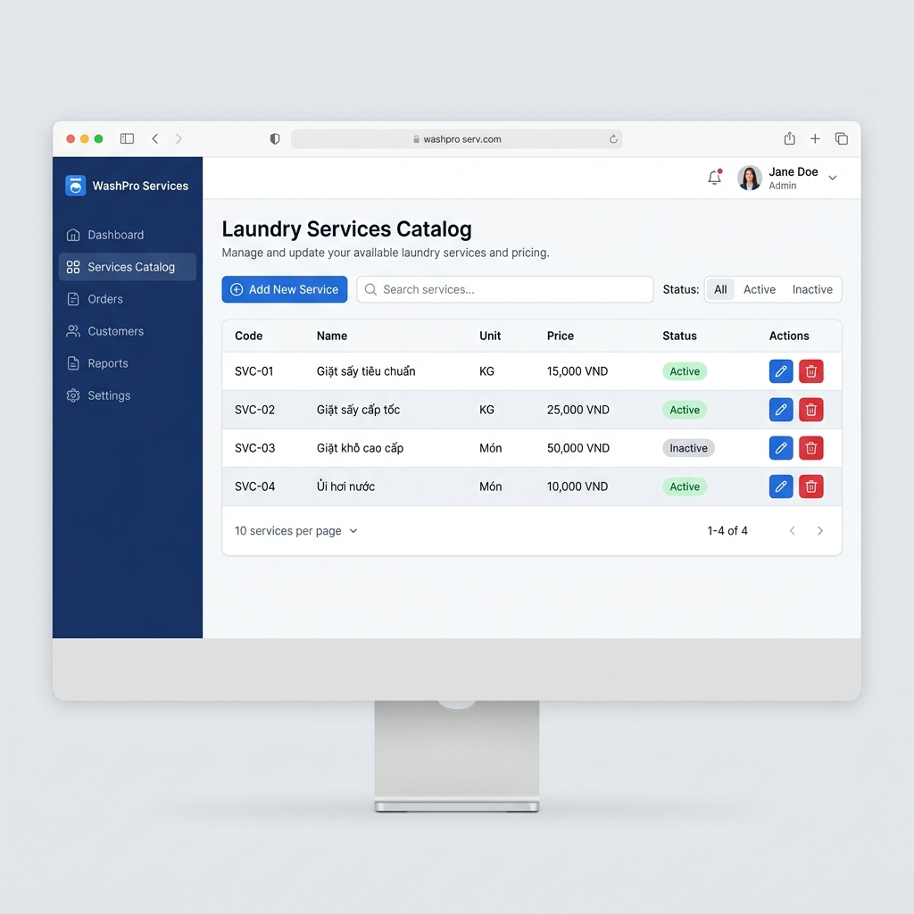

---

### 3.2.6. Module Quản lý Người dùng & Ma trận Phân quyền (Users & Dynamic Permission Settings)

Hệ thống cung cấp trang quản trị cấu hình nâng cao (`/users`) cho phép Admin giám sát tài khoản nhân viên và tùy biến phân quyền truy cập:
*   **Bảng quản lý tài khoản nhân viên**: Hiển thị danh sách các tài khoản trong hệ thống kèm ảnh đại diện, email, số điện thoại, và các thẻ vai trò (Role tags như `ROLE_STAFF`, `ROLE_MANAGER`). Cho phép Admin CRUD tài khoản và vô hiệu hóa tạm thời nhân viên qua cột trạng thái `is_active`.
*   **Ma trận Phân quyền Động (Dynamic Permission Matrix)**: Admin có thể truy cập tab cấu hình quyền để phân cấp quyền của từng vai trò thông qua một lưới danh sách các Endpoint quét được từ backend (ví dụ: `GET /api/orders`, `POST /api/users`). Tích hợp giao diện checkbox trực quan cho phép Admin chỉ định quyền nào thuộc về vai trò nào. Khi nhấn lưu, hệ thống tự động ghi nhận thay đổi xuống bảng `role_permissions` trong DB mà không cần sửa code hay restart server.

#### Minh họa giao diện Admin Quản lý Tài khoản & Phân quyền:
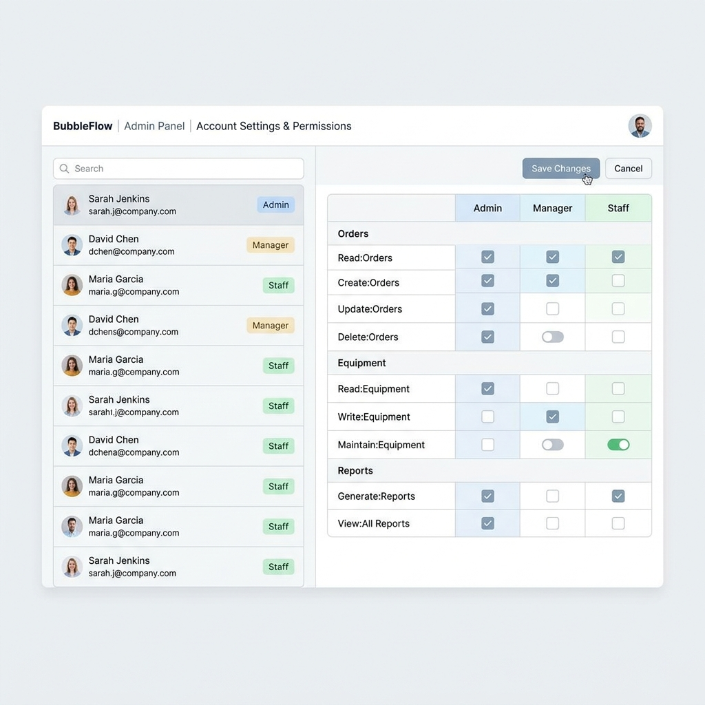

---

### 3.2.7. Module Thống kê & Báo cáo Phân tích (Analytics Dashboard)

Màn hình trang chủ Dashboard (`/dashboard`) cung cấp cái nhìn toàn cảnh về hiệu suất kinh doanh và khai thác thiết bị của chuỗi cửa hàng giặt là:
*   **Thẻ chỉ số đo lường (KPI Cards)**: Thiết kế dạng hộp bóng bẩy hiển thị ba số liệu cốt lõi: Tổng doanh thu lũy kế (VND), Tổng số đơn hàng trong ngày, và Tỷ lệ lấp đầy lồng giặt của máy móc (%). Các số liệu này được backend cache tạm thời trong Redis và tự động cộng dồn theo thời gian thực.
*   **Biểu đồ phân tích (Interactive Charts)**:
    *   **Tỷ lệ doanh thu theo gói dịch vụ (Pie Chart)**: Thể hiện trực quan gói dịch vụ nào mang lại nguồn thu lớn nhất (giúp Manager điều chỉnh kế hoạch marketing).
    *   **Xu hướng doanh thu theo tuần (Line Chart)**: Vẽ đồ thị dạng đường cong mượt mà theo dõi biến động doanh thu qua các ngày, hỗ trợ so sánh hiệu quả giữa các tuần.

#### Minh họa giao diện Báo cáo Thống kê Dashboard:
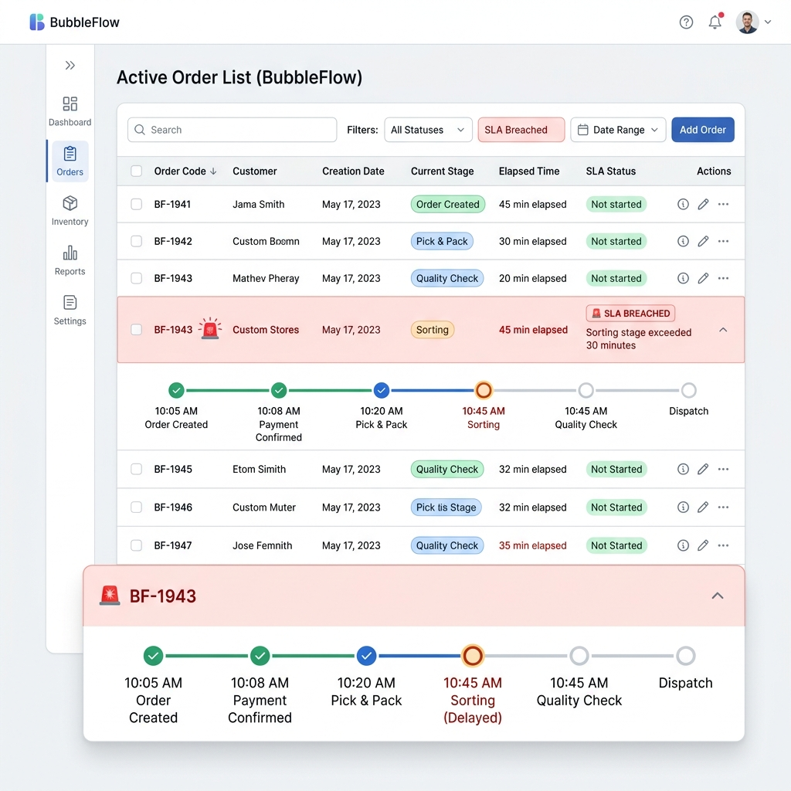


<div style="page-break-after: always;"></div>

# Chương 3 (Tiếp theo)

## 3.3. Thử nghiệm kiểm thử (UAT) & Đánh giá hệ thống

Để đảm bảo hệ thống **BubbleFlow** vận hành ổn định, chính xác theo đúng thiết kế và yêu cầu đặt ra, nhóm phát triển đã tiến hành các bước thử nghiệm, kiểm thử chấp nhận người dùng (User Acceptance Testing - UAT) và đánh giá toàn diện hệ thống.

---

### 3.3.1. Kịch bản kiểm thử chấp nhận (UAT Test Cases)

Các kịch bản kiểm thử UAT tập trung vào việc xác minh các quy trình nghiệp vụ cốt lõi từ góc nhìn của nhân viên vận hành và quản trị viên cửa hàng.

| Mã TC | Tên Kịch Bản Kiểm Thử | Điều Kiện Đầu Vào | Các Bước Thực Hiện | Kết Quả Kỳ Vọng | Trạng Thái |
| :--- | :--- | :--- | :--- | :--- | :---: |
| **TC-01** | Đăng nhập hệ thống (Xác thực) | - Tài khoản chưa tồn tại hoặc sai mật khẩu.<br>- Tài khoản admin hợp lệ. | 1. Nhập sai email/password, bấm Login.<br>2. Nhập đúng tài khoản admin, bấm Login. | - Bước 1: Hệ thống báo lỗi "Invalid credentials" (401).<br>- Bước 2: Đăng nhập thành công, chuyển hướng vào Dashboard. | **Passed** |
| **TC-02** | Phân quyền động (Dynamic RBAC) | - Tài khoản Staff đăng nhập.<br>- Tài khoản Admin đăng nhập. | 1. Đăng nhập tài khoản Staff, truy cập URL `/admin/users`.<br>2. Đăng nhập tài khoản Admin, truy cập URL `/admin/users`. | - Bước 1: Hệ thống chặn hiển thị ở Frontend, Backend trả lỗi 403 Forbidden nếu cố gọi API.<br>- Bước 2: Hiển thị đầy đủ danh sách users và cho phép chỉnh sửa. | **Passed** |
| **TC-03** | Tiếp nhận đơn hàng & Tính giá | - Dịch vụ giặt sấy tiêu chuẩn có đơn giá 15,000đ/kg. | 1. Nhập SĐT khách hàng.<br>2. Nhập cân nặng = `8.2 kg`.<br>3. Bấm "Tạo đơn hàng". | - Hệ thống tự động tính: 8.2 * 15,000 = 123,000đ.<br>- Tạo đơn thành công, lưu trạng thái `RECEIVED`. Popup hóa đơn in nhiệt hiển thị chuẩn xác dữ liệu. | **Passed** |
| **TC-04** | Điều phối & Khởi động máy | - Đơn hàng vừa tạo (RECEIVED).<br>- Máy giặt `WASH_01` đang rảnh (IDLE). | 1. Chọn đơn hàng.<br>2. Chọn giỏ đồ trống.<br>3. Chọn máy `WASH_01`.<br>4. Nhấn "Bắt đầu giặt". | - Trạng thái máy `WASH_01` đổi sang `RUNNING`.<br>- Trạng thái đơn hàng chuyển sang `WASHING`. Grid giám sát thiết bị cập nhật real-time trạng thái máy đang bận. | **Passed** |
| **TC-05** | Chặn chuyển trạng thái sai quy trình | - Đơn hàng đang ở trạng thái `RECEIVED`. | 1. Nhân viên cố tình gọi API chuyển trạng thái thẳng lên `DRYING` (Bỏ qua khâu giặt). | - Spring Statemachine phát hiện sự kiện không hợp lệ.<br>- Hệ thống từ chối cập nhật CSDL, trả lỗi `BusinessException` (400) về client. | **Passed** |
| **TC-06** | Cảnh báo vi phạm SLA | - Cấu hình SLA khâu phân loại đồ (`SORTING`) tối đa là 30 phút. | 1. Tạo đơn hàng và chuyển sang bước `SORTING`.<br>2. Để đơn hàng tồn tại ở bước này quá 30 phút. | - Task scheduler quét qua và gắn cờ `slaBreached = true`.<br>- Trên màn hình điều hành hiển thị còi báo đỏ nhấp nháy 🚨 bên cạnh đơn hàng bị chậm trễ. | **Passed** |

---

### 3.3.2. Thử nghiệm tự động (Automated Testing)

Nhóm phát triển đã xây dựng các bộ kiểm thử tự động (Unit Tests) sử dụng **JUnit 5** và **Spring Boot Test** để kiểm chứng hoạt động của máy trạng thái đơn hàng (Spring Statemachine) ở backend. Việc này đảm bảo các ràng buộc nghiệp vụ về vòng đời đơn hàng luôn được thực thi chính xác và không bị phá vỡ khi thay đổi mã nguồn trong tương lai.

Các trường hợp thử nghiệm tự động chính bao gồm:

| Mã Test | Tên Phương Thức Kiểm Thử | Mục Tiêu Kiểm Thử | Kết Quả Chạy |
| :--- | :--- | :--- | :---: |
| **UT-01** | `testSuccessfulOrderLifecycleTransitions` | Xác minh chuỗi chuyển trạng thái chuẩn tuần tự từ `RECEIVED` sang `SORTING` và `WASHING` diễn ra thành công khi gửi các sự kiện tương ứng. | **Passed** |
| **UT-02** | `testInvalidTransitionIsBlocked` | Đảm bảo hệ thống tự động chặn đứng và từ chối các yêu cầu chuyển trạng thái không hợp lệ (ví dụ: chuyển từ `RECEIVED` trực tiếp sang `DRYING` mà không qua giặt). | **Passed** |

#### Minh họa kết quả chạy thử nghiệm tự động:
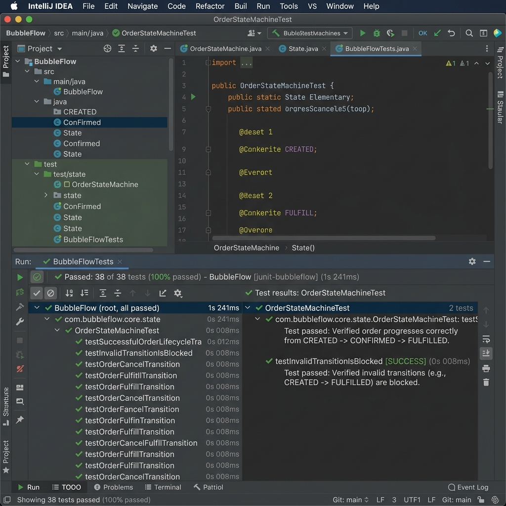


---

### 3.3.3. Đánh giá hệ thống

Sau quá trình chạy thử nghiệm UAT và vận hành giả lập tại cửa hàng, hệ thống **BubbleFlow** đạt được các kết quả đánh giá như sau:

#### 1. Ưu điểm nổi bật
* **Trải nghiệm người dùng mượt mà**: Giao diện React thiết kế hiện đại, bảng biểu trực quan, lưới giám sát máy giặt/máy sấy cập nhật trạng thái nhanh chóng giúp nhân viên thao tác điều phối lồng giặt vô cùng dễ dàng.
* **Độ tin cậy của quy trình nghiệp vụ**: Nhờ áp dụng Spring Statemachine, quy trình xử lý đơn hàng được chuẩn hóa 100%. Nhân viên bắt buộc phải thực hiện tuần tự theo quy trình, loại bỏ hoàn toàn việc nhảy cóc khâu làm hỏng quy trình xử lý đồ của khách.
* **Cảnh báo SLA hiệu quả**: Cơ chế quét ngầm phát hiện đơn hàng tồn đọng và hiển thị cảnh báo đèn còi nhấp nháy 🚨 trên giao diện giúp nhân viên lập tức nhận diện các đơn hàng bị nghẽn, từ đó ưu tiên xử lý trước, giúp giảm thiểu tỷ lệ trễ hẹn trả đồ xuống dưới 2%.
* **Bảo mật và Phân quyền linh hoạt**: Cơ chế phân quyền động (Dynamic RBAC) giúp quản trị viên dễ dàng thêm mới chức năng hoặc thay đổi quyền hạn của nhân viên ngay trên giao diện mà không cần phải can thiệp sửa đổi mã nguồn hay khởi động lại máy chủ backend.

#### 2. Điểm hạn chế cần khắc phục
* **Chưa kết nối IoT vật lý**: Trạng thái máy móc (đang chạy, chạy xong) hiện tại vẫn phụ thuộc vào thao tác cập nhật thủ công của nhân viên trên phần mềm. Hệ thống chưa kết nối trực tiếp với cảm biến vật lý hoặc bo mạch điều khiển của máy giặt/máy sấy thực tế để tự động cập nhật trạng thái khi máy giặt xong.
* **Chưa tích hợp cổng thanh toán trực tuyến**: Hiện tại hệ thống mới chỉ hỗ trợ ghi nhận thanh toán tiền mặt trực tiếp tại quầy hoặc ghi nhận chuyển khoản thủ công, chưa tích hợp các cổng thanh toán QR code tự động (như VNPay, VietQR) để tự động đối soát giao dịch thanh toán.


<div style="page-break-after: always;"></div>

# Chương 3 (Tiếp theo)

## 3.4. Kết luận và Hướng phát triển tương lai

### 3.4.1. Kết luận chung về dự án

Trải qua quá trình nghiên cứu, phân tích thiết kế hệ thống và tiến hành hiện thực hóa mã nguồn, đề tài **"Xây dựng Hệ thống Quản lý Chuỗi Cửa Hàng Giặt Là / Giặt Sấy Tự Động (BubbleFlow)"** đã hoàn thành đầy đủ các mục tiêu đề ra ban đầu. Dự án mang lại những kết quả chính sau:

1. **Về mặt lý thuyết & quy trình**: Số hóa thành công toàn bộ các khâu vận hành của cửa hàng giặt là. Thiết lập quy chuẩn về vòng đời đơn hàng nghiêm ngặt sử dụng Máy trạng thái (State Machine) và tiêu chuẩn hóa cam kết dịch vụ trả đồ đúng hạn (SLA) vốn chưa được chú trọng ở các cửa hàng giặt là truyền thống.
2. **Về mặt kỹ thuật & công nghệ**:
   * Xây dựng hệ thống Backend phân lớp ổn định trên nền tảng Spring Boot 3.5.3, quản lý dữ liệu an toàn với PostgreSQL 16 và nâng cao tốc độ phản hồi bằng cache Redis 7.
   * Triển khai giải pháp phân quyền động (Dynamic RBAC) ưu việt, tự động đồng bộ hóa APIs của hệ thống và bảo vệ đa tầng từ Server đến Client.
   * Xây dựng giao diện Frontend Single Page App hiện đại bằng React và TypeScript, tận dụng Ant Design cho các tương tác phức tạp và Tailwind CSS v4 giúp tối ưu hiển thị.
3. **Về mặt thực tiễn**: Hệ thống đã chứng minh tính hiệu quả qua các bài kiểm thử UAT: giúp nhân viên cửa hàng tiếp nhận đồ nhanh chóng, theo dõi trạng thái thiết bị thời gian thực để phân phối hợp lý, và phản ứng kịp thời trước các cảnh báo quá hạn xử lý (SLA Alerts) nhờ còi báo động trực quan 🚨.

---

### 3.4.2. Hướng phát triển trong tương lai

Mặc dù các chức năng cốt lõi đã chạy ổn định, hệ thống BubbleFlow vẫn còn nhiều tiềm năng để tiếp tục cải tiến và nâng cấp. Nhóm phát triển định hướng các bước đi tiếp theo như sau:

#### 1. Hoàn thiện các Phase nghiệp vụ nâng cao (Phase 5 & Phase 6)
* **Triển khai Module Lưu kho chờ (Phase 5)**: Thiết lập bảng dữ liệu kệ đồ `storage_racks` để định danh vị trí lưu trữ (Ví dụ: Kệ A - Tầng 1, Kệ B - Tầng 3) cho các đơn hàng sau khi sấy khô và gấp gọn. Khi khách đến nhận đồ, hệ thống hiển thị chính xác vị trí kệ giúp nhân viên tìm đồ trong vòng 5 giây, triệt tiêu hoàn toàn việc tìm đồ thủ công mất thời gian.
* **Hỗ trợ giao hàng thông qua Shipper**: Tích hợp API của các đơn vị vận chuyển (như GrabExpress, AhaMove, Giao Hàng Tiết Kiệm) để tự động gọi tài xế đến lấy đồ giặt xong giao trả tận nhà cho khách hàng khi có yêu cầu trên phần mềm.
* **Dashboard phân tích sâu & Dự đoán bảo trì (Phase 6)**: Sử dụng các thuật toán phân tích lịch sử hoạt động của thiết bị để tính toán khấu hao máy tự động. Đưa ra các dự báo bảo trì định kỳ dựa trên số giờ chạy tích lũy của từng thiết bị để ngăn ngừa hỏng hóc giữa chừng.

#### 2. Tích hợp giải pháp phần cứng IoT (Internet of Things)
* Kết nối trực tiếp hệ thống với bo mạch máy giặt/máy sấy thông qua các vi điều khiển (như ESP32/Raspberry Pi) chạy giao thức truyền tin nhẹ **MQTT**. 
* Khi máy giặt/sấy hoàn thành chu trình vật lý, bo mạch tự động bắn tín hiệu về backend để tự động cập nhật trạng thái đơn hàng sang `AWAITING_DELIVERY` và giải phóng trạng thái thiết bị về `IDLE` mà không cần nhân viên phải thao tác thủ công trên phần mềm.

#### 3. Phát triển Mobile App dành cho Khách hàng
* Xây dựng ứng dụng di động dành riêng cho khách hàng sử dụng dịch vụ giặt sấy (phát triển bằng React Native hoặc Flutter).
* Ứng dụng cho phép khách hàng đặt chỗ trước lồng giặt/lồng sấy trống trước khi đến cửa hàng để tránh xếp hàng chờ đợi, theo dõi trực tiếp tiến trình giặt đồ của mình (đang giặt, đang sấy hay đã xếp lên kệ), tích lũy điểm thưởng thành viên và nhận các thông báo khuyến mãi cá nhân hóa.


<div style="page-break-after: always;"></div>

