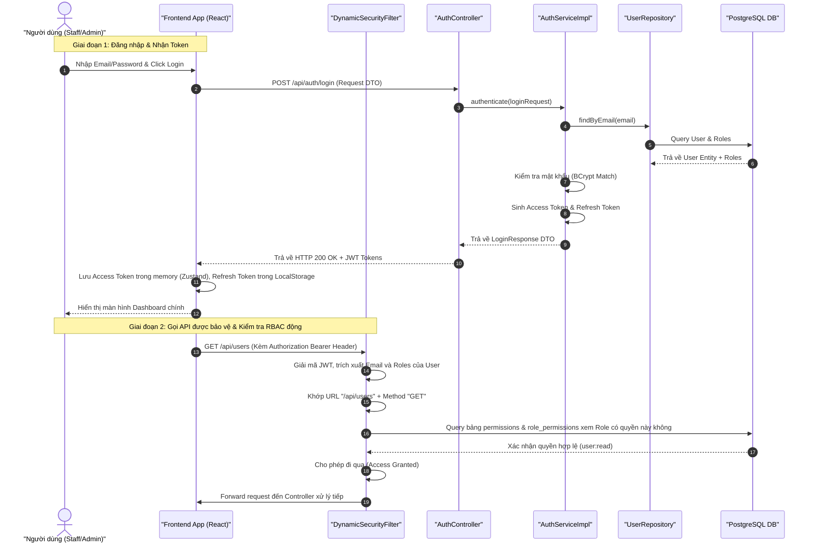
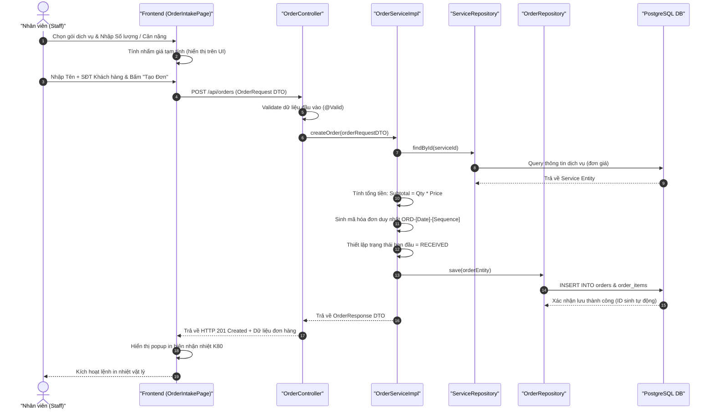
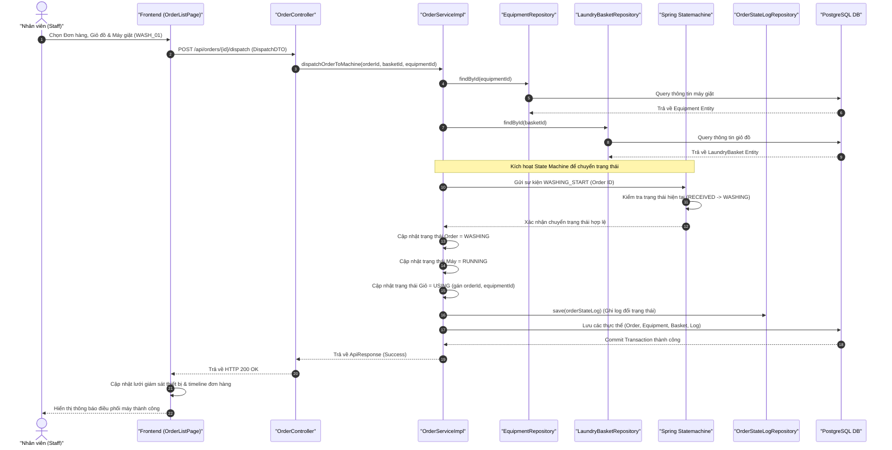
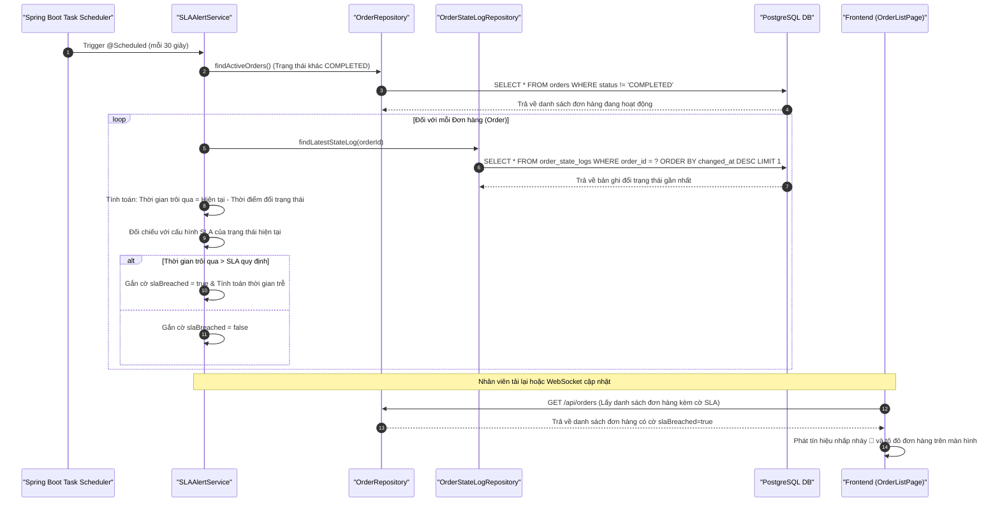

# Chương 2 (Tiếp theo)

## 2.3. Thiết kế Động - Biểu đồ tuần tự (Sequence Diagrams)

Để mô tả sự tương tác động giữa các thành phần trong hệ thống (Frontend, Security Filter, Controllers, Services, Repositories và Database), phần này thiết lập 4 biểu đồ tuần tự cho các luồng nghiệp vụ cốt lõi bằng cú pháp Mermaid.

---

### 2.3.1. Biểu đồ tuần tự luồng Đăng nhập & Phân quyền động (Dynamic RBAC)

Luồng đăng nhập thực hiện xác thực người dùng, cấp Access Token/Refresh Token. Sau đó, mỗi khi có yêu cầu gọi API, bộ lọc `Dynamic AuthorizationManager` của Spring Security sẽ kiểm tra quyền truy cập động bằng cách đối chiếu thông tin yêu cầu với dữ liệu quyền của người dùng trong cơ sở dữ liệu.

---

### 2.3.2. Biểu đồ tuần tự luồng Tiếp nhận đơn hàng & Tính giá tự động

Khi nhân viên tiếp nhận đồ bẩn, nhập cân nặng hoặc số lượng món, hệ thống tự động gọi dữ liệu bảng giá dịch vụ để tính tiền và lưu trữ đơn hàng.

---

### 2.3.3. Biểu đồ tuần tự luồng Điều phối & Gán giỏ đồ vào máy chạy

Quy trình nhân viên gán giỏ đồ của đơn hàng vào một máy giặt/máy sấy đang rảnh. Trạng thái máy được cập nhật thời gian thực và Spring Statemachine kiểm soát việc chuyển đổi trạng thái của đơn hàng.

---

### 2.3.4. Biểu đồ tuần tự luồng Tác vụ ngầm quét và phát hiện vi phạm SLA

Luồng tự động chạy ngầm dưới nền của máy chủ (Background Job) để phát hiện trễ hẹn ở từng trạng thái xử lý đơn hàng.

