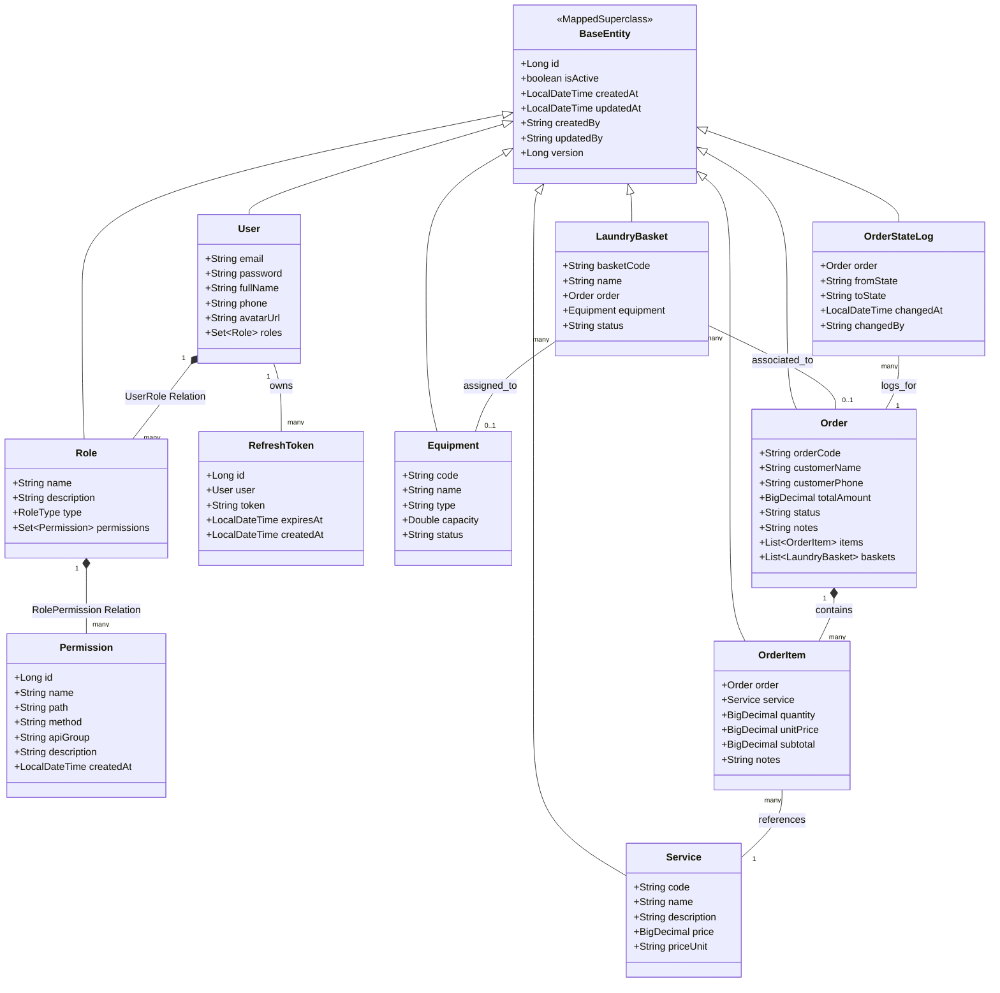

# Chương 2 (Tiếp theo)

## 2.4. Thiết kế Tĩnh - Biểu đồ lớp & Sơ đồ CSDL (ERD)

Thiết kế tĩnh của hệ thống BubbleFlow tập trung vào việc mô tả cấu trúc lưu trữ dữ liệu dưới cơ sở dữ liệu vật lý (ERD) và cấu trúc lớp đối tượng Java ở mức thực thể (Entity Class Diagram) ánh xạ trực tiếp bằng Hibernate/JPA.

---

### 2.4.1. Sơ đồ thực thể liên kết cơ sở dữ liệu (ERD)

Sơ đồ ERD dưới đây mô tả chi tiết các bảng, trường dữ liệu, khóa chính (PK), khóa ngoại (FK), kiểu dữ liệu và mối quan hệ giữa các bảng trong hệ quản trị cơ sở dữ liệu PostgreSQL.

```mermaid
erDiagram
    users {
        bigint id PK
        varchar email "UNIQUE"
        varchar password
        varchar full_name
        varchar phone
        varchar avatar_url
        boolean is_active
        timestamp created_at
        timestamp updated_at
        varchar created_by
        varchar updated_by
        bigint version
    }

    roles {
        bigint id PK
        varchar name "UNIQUE"
        varchar description
        varchar type "ALL / CUSTOM"
        boolean is_active
        timestamp created_at
        timestamp updated_at
        varchar created_by
        varchar updated_by
        bigint version
    }

    user_roles {
        bigint id PK
        bigint user_id FK
        bigint role_id FK
    }

    permissions {
        bigint id PK
        varchar name "UNIQUE"
        varchar path
        varchar method
        varchar api_group
        varchar description
        timestamp created_at
    }

    role_permissions {
        bigint id PK
        bigint role_id FK
        bigint permission_id FK
    }

    refresh_tokens {
        bigint id PK
        bigint user_id FK
        varchar token "UNIQUE"
        timestamp expires_at
        timestamp created_at
    }

    services {
        bigint id PK
        varchar code "UNIQUE"
        varchar name
        text description
        numeric price
        varchar price_unit "KG / ITEM"
        boolean is_active
        timestamp created_at
        timestamp updated_at
        varchar created_by
        varchar updated_by
        bigint version
    }

    equipments {
        bigint id PK
        varchar code "UNIQUE"
        varchar name
        varchar type "WASHING_MACHINE / DRYER"
        double capacity
        varchar status "IDLE / RUNNING / MAINTENANCE / OUT_OF_SERVICE"
        boolean is_active
        timestamp created_at
        timestamp updated_at
        varchar created_by
        varchar updated_by
        bigint version
    }

    orders {
        bigint id PK
        varchar order_code "UNIQUE"
        varchar customer_name
        varchar customer_phone
        numeric total_amount
        varchar status "RECEIVED / SORTING / WASHING / DRYING / AWAITING_DELIVERY / COMPLETED"
        text notes
        boolean is_active
        timestamp created_at
        timestamp updated_at
        varchar created_by
        varchar updated_by
        bigint version
    }

    order_items {
        bigint id PK
        bigint order_id FK
        bigint service_id FK
        numeric quantity
        numeric unit_price
        numeric subtotal
        text notes
        boolean is_active
        timestamp created_at
        timestamp updated_at
        varchar created_by
        varchar updated_by
        bigint version
    }

    laundry_baskets {
        bigint id PK
        varchar basket_code "UNIQUE"
        varchar name
        bigint order_id FK
        bigint equipment_id FK
        varchar status "IDLE / USING"
        boolean is_active
        timestamp created_at
        timestamp updated_at
        varchar created_by
        varchar updated_by
        bigint version
    }

    order_state_logs {
        bigint id PK
        bigint order_id FK
        varchar from_state
        varchar to_state
        timestamp changed_at
        varchar changed_by
        boolean is_active
        timestamp created_at
        timestamp updated_at
        varchar created_by
        varchar updated_by
        bigint version
    }

    %% Relationships
    users ||--o{ user_roles : "owns"
    roles ||--o{ user_roles : "assigned_to"
    roles ||--o{ role_permissions : "contains"
    permissions ||--o{ role_permissions : "mapped_to"
    users ||--o{ refresh_tokens : "issues"
    
    orders ||--o{ order_items : "has"
    services ||--o{ order_items : "referenced"
    orders ||--o{ laundry_baskets : "carried_by"
    equipments ||--o{ laundry_baskets : "holds"
    orders ||--o{ order_state_logs : "tracks"
```

---

### 2.4.2. Biểu đồ lớp thực thể (Entity Class Diagram)

Các thực thể trong Java Backend đều kế thừa từ lớp cha `BaseEntity` (nơi định nghĩa các cột kiểm toán tự động như `created_at`, `updated_at`, `created_by`, `updated_by` và trường `version` phục vụ Khóa lạc quan - Optimistic Locking).

