# CHƯƠNG 2: PHÂN TÍCH YÊU CẦU VÀ THIẾT KẾ HỆ THỐNG

## 2.1. Xác định các yêu cầu của hệ thống

### 2.1.1. Mô tả kiến trúc hệ thống 3 tầng
Hệ thống **BubbleFlow** được thiết kế dựa trên kiến trúc 3 tầng tiêu chuẩn (Three-Tier Architecture) giúp đảm bảo tính phân tách độc lập giữa các lớp, dễ bảo trì, mở rộng và tăng cường khả năng bảo mật.

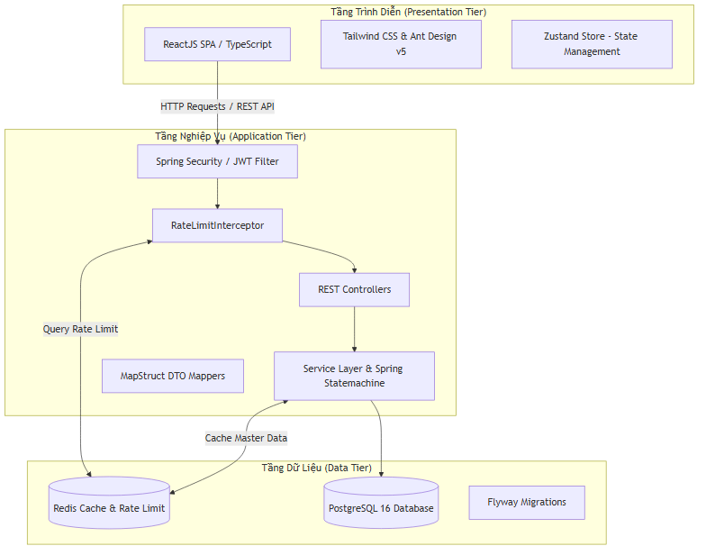

*Hình 2.1: Kiến trúc hệ thống 3 tầng BubbleFlow*

1.  **Tầng trình diễn (Presentation Tier)**:
    *   **Công nghệ**: ReactJS (Single Page Application - SPA), TypeScript, Tailwind CSS và Ant Design v5 làm thư viện thành phần chính.
    *   **Nhiệm vụ**: Đảm nhận vai trò giao tiếp trực tiếp với người dùng. Nhận dữ liệu nhập từ người dùng, hiển thị thông tin trực quan, quản lý trạng thái client bằng **Zustand**, và thực hiện gửi các yêu cầu REST API thông qua **Axios** với cơ chế tự động đính kèm mã xác thực JWT.

2.  **Tầng nghiệp vụ (Application Tier)**:
    *   **Công nghệ**: Spring Boot 3.5.3 (Java 21), Spring Security, Spring Statemachine.
    *   **Nhiệm vụ**:
        *   **Xác thực và Phân quyền**: Spring Security phối hợp với JWT Filter xử lý kiểm tra mã Access Token. Bộ phân quyền động (Dynamic AuthorizationManager) kiểm tra quyền truy cập API dựa trên phân quyền cấu hình trực tiếp từ CSDL.
        *   **Kiểm soát Tần suất (Rate Limiting)**: `RateLimitInterceptor` chặn và tính toán số lượt request của IP thông qua Redis.
        *   **Điều phối Nghiệp vụ**: Các Service xử lý business logic như tự động tính giá đơn hàng theo kg hoặc món, kiểm soát vòng đời đơn hàng bằng Spring Statemachine, và sinh hóa đơn in nhiệt bằng OpenPDF.

3.  **Tầng dữ liệu (Data Tier)**:
    *   **Công nghệ**: PostgreSQL 16 (Hệ quản trị CSDL chính), Redis 7 (Bộ nhớ đệm hiệu năng cao & Quản lý rate limit), Flyway (Kiểm soát phiên bản schema).
    *   **Nhiệm vụ**: Lưu trữ thông tin nghiệp vụ lâu dài (orders, users, equipments...). Redis lưu trữ các session token phụ tải ngắn hạn, lịch sử rate limit, và cache các danh mục cấu hình hệ thống (Services, Settings) để giảm tải cho PostgreSQL.

---

### 2.1.2. Xác định danh sách tác nhân hệ thống
Hệ thống BubbleFlow phân tách rõ ràng quyền lợi và trách nhiệm của 3 tác nhân chính:

1.  **Khách hàng (Customer)**:
    *   Là đối tượng sử dụng dịch vụ giặt sấy của hệ thống.
    *   Hành vi: Cung cấp thông tin cá nhân (Tên, SĐT), theo dõi trạng thái đơn hàng trực tuyến, thực hiện thanh toán tại quầy hoặc chuyển khoản ngân hàng, nhận hóa đơn in nhiệt và nhận lại đồ.
2.  **Nhân viên vận hành (Operator/Staff)**:
    *   Là người trực tiếp làm việc tại cửa hàng, tiếp nhận đồ từ khách hàng, điều phối máy móc và giao trả đồ.
    *   Hành vi: Tạo đơn hàng tại quầy (Order Intake), in biên nhận, quét mã giỏ đồ, gán giỏ đồ vào máy giặt/sấy đang rảnh, cập nhật tiến trình giặt sấy theo máy trạng thái, chuyển đồ hoàn thành vào kệ lưu kho (Storage Rack), cập nhật trạng thái thanh toán và bàn giao trả đồ.
3.  **Quản trị viên (Admin)**:
    *   Là người quản lý chuỗi, giám sát toàn bộ hoạt động kinh doanh và cấu hình hệ thống.
    *   Hành vi: CRUD tài khoản người dùng/nhân viên, phân quyền động thông qua vai trò (Roles & Permissions), CRUD danh mục gói dịch vụ và bảng giá, CRUD thiết bị máy móc, xem dashboard báo cáo thống kê doanh thu và tần suất hoạt động của máy, kết xuất báo cáo Excel báo cáo hiệu suất chuỗi.

---

### 2.1.3. Biểu đồ Use Case tổng quan
Biểu đồ Use Case tổng quan biểu diễn mối liên hệ giữa các tác nhân và các phân hệ chức năng cốt lõi của BubbleFlow:

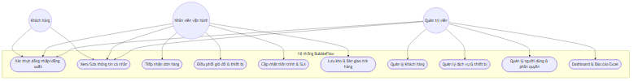

*Hình 2.2: Sơ đồ Use Case tổng quan hệ thống BubbleFlow*

---

## 2.2. Phân tích chi tiết yêu cầu chức năng

Dưới đây là đặc tả chi tiết 11 Use Cases cốt lõi cấu thành nên hệ thống quản lý chuỗi giặt là thông minh BubbleFlow.

### 2.2.1. Use Case 1: Đăng nhập & Xác thực hệ thống (JWT + Refresh Token)
*   **Mô tả**: Cho phép người dùng (Nhân viên/Admin) đăng nhập vào hệ thống để bắt đầu phiên làm việc. Hệ thống sẽ cấp cặp mã token xác thực gồm Access Token (hạn 15 phút) và Refresh Token (hạn 7 ngày).

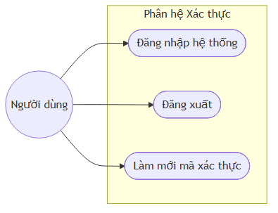

*Hình 2.3: Sơ đồ Use Case con - Xác thực*

*   **Bảng kịch bản Use Case Đăng nhập**:

| Thành phần | Đặc tả chi tiết |
| :--- | :--- |
| **Tên Use Case** | Đăng nhập hệ thống |
| **Tác nhân** | Người dùng (Staff, Admin) |
| **Tiền điều kiện** | Tài khoản đã được tạo và kích hoạt (is_active = true) |
| **Hậu điều kiện** | Hệ thống lưu trữ thông tin đăng nhập trong Zustand store, cấp cặp JWT token hợp lệ |
| **Luồng sự kiện chính** | 1. Người dùng truy cập trang Đăng nhập. 2. Người dùng nhập Email và Mật khẩu đăng nhập. 3. Người dùng nhấn nút "Đăng nhập". 4. Hệ thống mã hóa thông tin, gửi yêu cầu POST đến API `/api/auth/login`. 5. Backend đối chiếu cơ sở dữ liệu, kiểm tra mật khẩu đã được băm (BCrypt). 6. Nếu chính xác, sinh Access Token và Refresh Token. 7. Trả về thông tin người dùng cùng danh sách quyền lợi và cặp token. 8. Frontend lưu Access Token vào bộ nhớ tạm (state), chuyển hướng sang màn hình Dashboard. |
| **Luồng ngoại lệ** | - *Sai mật khẩu/email*: Hệ thống trả về lỗi 401 Unauthorized, hiển thị thông báo "Tài khoản hoặc mật khẩu không chính xác". - *Tài khoản bị khóa*: Trả về lỗi 400 Bad Request, thông báo "Tài khoản của bạn đã bị khóa". |

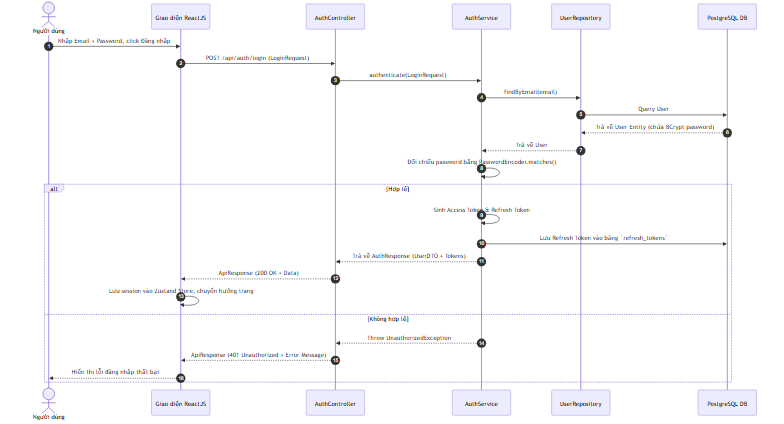

*Hình 2.4: Biểu đồ tuần tự - Đăng nhập*

---

### 2.2.2. Use Case 2: Quản lý Người dùng & Phân quyền động (Dynamic RBAC)
*   **Mô tả**: Admin thực hiện quản lý tài khoản nhân viên và phân bổ quyền truy cập API. Hệ thống tự động đồng bộ hóa các endpoint Controller thành quyền hạn, cho phép gán quyền động cho từng vai trò (Role).

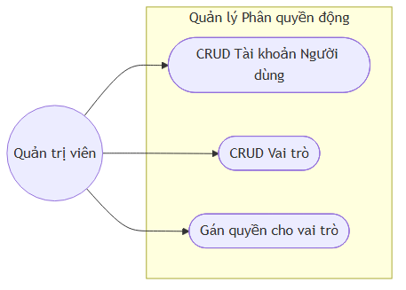

*Hình 2.5: Sơ đồ Use Case con - Phân quyền động*

*   **Bảng kịch bản Use Case Gán quyền cho vai trò**:

| Thành phần | Đặc tả chi tiết |
| :--- | :--- |
| **Tên Use Case** | Gán quyền (Permissions) cho vai trò |
| **Tác nhân** | Quản trị viên (Admin) |
| **Tiền điều kiện** | Vai trò cần cấu hình phải thuộc loại `CUSTOM` (vai trò mặc định `ALL` có toàn bộ quyền và không thể sửa) |
| **Hậu điều kiện** | Các quyền mới được lưu vào bảng `role_permissions` và có hiệu lực tức thời |
| **Luồng sự kiện chính** | 1. Admin truy cập trang Cấu hình Vai trò & Phân quyền. 2. Chọn một vai trò (ví dụ: Nhân viên giặt sấy). 3. Hệ thống hiển thị danh sách các quyền hạn được gom nhóm theo Controller tương ứng phía Backend. 4. Admin tích chọn hoặc bỏ chọn các hộp kiểm (Checkboxes) tương ứng với từng quyền truy cập API. 5. Admin nhấn "Lưu cấu hình". 6. Frontend gửi danh sách ID Permission mới tới Backend qua API `/api/roles/{id}` (PUT request). 7. Backend cập nhật bảng liên kết `role_permissions` cho vai trò này. 8. Trả về thông báo thành công. |
| **Luồng ngoại lệ** | - *Thay đổi quyền của vai trò mặc định (SYSTEM_ADMIN)*: Backend trả về lỗi 400 Bad Request, thông báo "Không được sửa đổi vai trò hệ thống mặc định". |

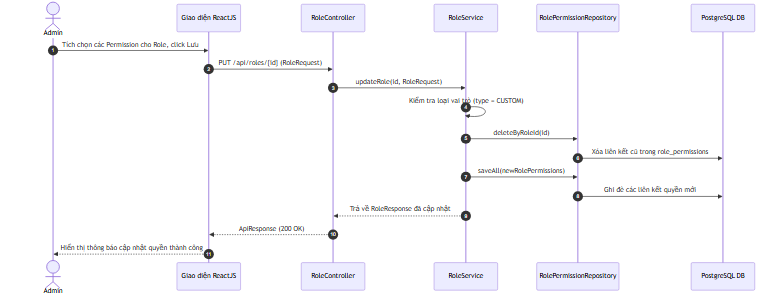

*Hình 2.6: Biểu đồ tuần tự - Gán quyền cho vai trò*

---

### 2.2.3. Use Case 3: Quản lý Danh mục Dịch vụ & Gói cước (Services)
*   **Mô tả**: Cho phép Admin cấu hình bảng giá và dịch vụ của chuỗi cửa hàng, phục vụ cho việc tự động tính tiền tại quầy.

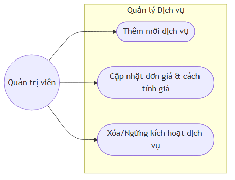

*Hình 2.7: Sơ đồ Use Case con - Quản lý Dịch vụ*

*   **Bảng kịch bản Use Case Thêm mới dịch vụ**:

| Thành phần | Đặc tả chi tiết |
| :--- | :--- |
| **Tên Use Case** | Thêm mới dịch vụ |
| **Tác nhân** | Quản trị viên (Admin) |
| **Tiền điều kiện** | Admin đã đăng nhập hệ thống và có quyền `SERVICE:CREATE` |
| **Hậu điều kiện** | Dịch vụ mới được tạo thành công, lưu vào DB và cập nhật lên cache Redis |
| **Luồng sự kiện chính** | 1. Admin vào trang quản lý dịch vụ và nhấn nút "Thêm dịch vụ mới". 2. Nhập mã dịch vụ (duy nhất), tên dịch vụ, đơn giá, cách tính giá (giặt theo kg hoặc sấy theo kg hoặc giặt khô theo món), thời gian thực hiện cam kết (SLA Hours) và mô tả. 3. Nhấn "Xác nhận". 4. Frontend gọi API POST `/api/services`. 5. Backend xác thực, kiểm tra trùng lặp mã dịch vụ. 6. Thêm bản ghi vào bảng `services`, xóa cache Redis để đảm bảo cập nhật đồng bộ. 7. Trả về thông tin dịch vụ vừa tạo. |
| **Luồng ngoại lệ** | - *Trùng mã dịch vụ*: Backend ném ra `DuplicateResourceException` (lỗi 409), thông báo "Mã dịch vụ đã tồn tại". |

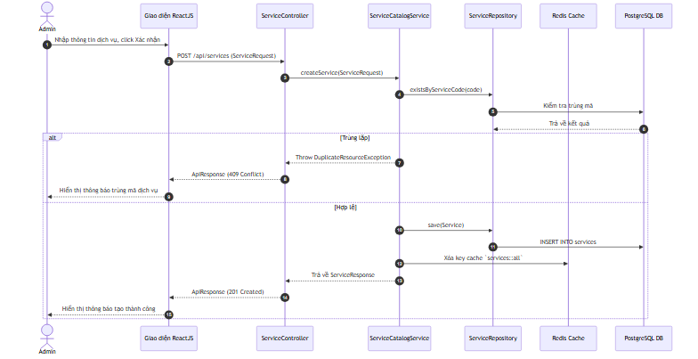

*Hình 2.8: Biểu đồ tuần tự - Thêm mới dịch vụ*

---

### 2.2.4. Use Case 4: Quản lý Thiết bị & Giám sát (Equipment Monitoring)
*   **Mô tả**: Admin quản lý thông số máy móc (máy giặt, máy sấy). Hệ thống cập nhật thời gian chạy tích lũy, số lần sử dụng và trạng thái (Rảnh, Đang chạy, Bảo trì) phục vụ giám sát real-time.

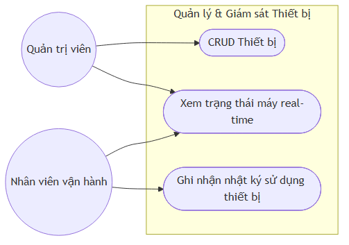

*Hình 2.9: Sơ đồ Use Case con - Thiết bị*

*   **Bảng kịch bản Use Case Xem trạng thái máy real-time**:

| Thành phần | Đặc tả chi tiết |
| :--- | :--- |
| **Tên Use Case** | Xem trạng thái máy real-time |
| **Tác nhân** | Nhân viên vận hành, Quản trị viên |
| **Tiền điều kiện** | Thiết bị đã được cấu hình trong bảng `equipments` |
| **Hậu điều kiện** | Hiển thị chính xác trạng thái hiện thời của từng máy |
| **Luồng sự kiện chính** | 1. Người dùng truy cập phân hệ Giám sát Thiết bị (`/equipment`). 2. Frontend gửi yêu cầu lấy danh sách thiết bị kèm các tham số đếm ngược thời gian chạy qua GET `/api/equipments`. 3. Backend truy xuất dữ liệu từ bảng `equipments` và `laundry_baskets` đang gán trực tiếp vào máy. 4. Trả về danh sách máy kèm thông tin chi tiết (loại máy, công suất, trạng thái: IDLE, RUNNING, MAINTENANCE, thời gian bắt đầu chạy và thời gian dự kiến xong). 5. Frontend hiển thị dưới dạng lưới (Grid) với các màu sắc trực quan (Xanh: Rảnh, Cam: Đang chạy, Đỏ: Bảo trì). |

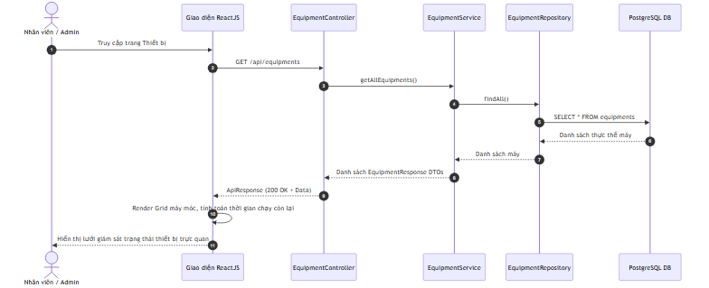

*Hình 2.10: Biểu đồ tuần tự - Xem trạng thái máy real-time*

---

### 2.2.5. Use Case 5: Tiếp nhận Đơn hàng & Tính giá tự động (Order Intake)
*   **Mô tả**: Nhân viên tiếp nhận quần áo bẩn từ khách hàng, cân trọng lượng, chọn loại dịch vụ, hệ thống tự động áp giá, tính tổng tiền, sinh mã vạch đơn hàng và sinh hóa đơn in nhiệt bằng OpenPDF.

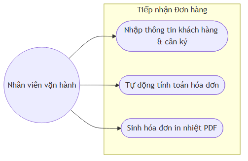

*Hình 2.11: Sơ đồ Use Case con - Tiếp nhận đơn hàng*

*   **Bảng kịch bản Use Case Tiếp nhận Đơn hàng & Tính giá tự động**:

| Thành phần | Đặc tả chi tiết |
| :--- | :--- |
| **Tên Use Case** | Tiếp nhận Đơn hàng & Tính giá tự động |
| **Tác nhân** | Nhân viên vận hành (Operator) |
| **Tiền điều kiện** | Các dịch vụ (Services) đã được thiết lập sẵn trong danh mục |
| **Hậu điều kiện** | Đơn hàng mới được tạo ở trạng thái `RECEIVED`, mã đơn hàng duy nhất được sinh ra, trả về file PDF hóa đơn |
| **Luồng sự kiện chính** | 1. Nhân viên truy cập trang Tiếp nhận đơn hàng. 2. Nhập thông tin khách hàng (Tên, Số điện thoại. Nếu khách quen, chọn nhanh từ danh sách khách hàng). 3. Thêm các dòng dịch vụ (chọn Dịch vụ giặt/sấy, nhập cân nặng hoặc số lượng món). 4. Hệ thống tự động tính thành tiền cho từng dòng và tính tổng tiền đơn hàng. 5. Nhân viên nhập ghi chú và chọn hình thức giao trả đồ (PICKUP tại quầy hoặc gửi SHIPPER). 6. Nhấn nút "Tạo đơn hàng". 7. Frontend gửi yêu cầu POST đến API `/api/orders` với cấu trúc `OrderCreateRequest`. 8. Backend sinh mã đơn hàng (ví dụ: HD260726001), tạo bản ghi `orders` và `order_items` tương ứng với trạng thái mặc định `RECEIVED`. Ghi nhận log trạng thái ban đầu. 9. Backend trả về thông tin đơn hàng thành công. 10. Frontend tự động gọi API in hóa đơn `/api/orders/{id}/receipt` dạng PDF dòng byte để nhân viên in biên nhận cho khách. |
| **Luồng ngoại lệ** | - *Nhập dữ liệu thiếu*: Ví dụ cân nặng bằng 0 hoặc số lượng âm, Backend validate trả về lỗi 400 Bad Request kèm mô tả chi tiết trường dữ liệu lỗi, không ghi nhận đơn hàng. |

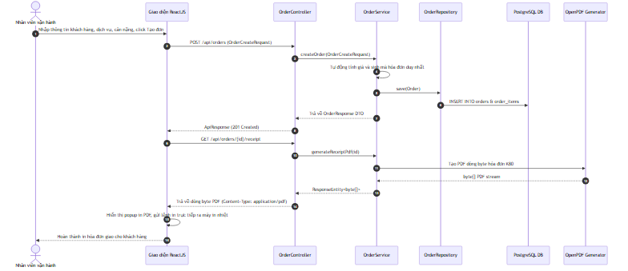

*Hình 2.12: Biểu đồ tuần tự - Tiếp nhận đơn hàng & in hóa đơn*

---

### 2.2.6. Use Case 6: Điều phối & Gán thiết bị (Dispatching)
*   **Mô tả**: Nhân viên vận hành lấy quần áo bẩn đã phân loại, bỏ vào giỏ đồ, quét mã giỏ đồ và chọn thiết bị (máy giặt/sấy) đang rảnh để gán giỏ đồ này vào máy hoạt động.

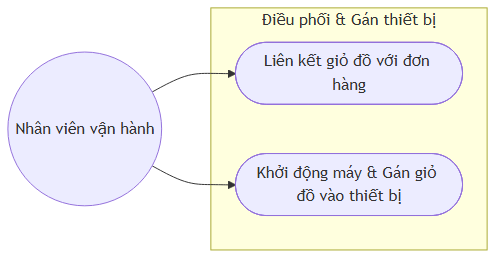

*Hình 2.13: Sơ đồ Use Case con - Điều phối thiết bị*

*   **Bảng kịch bản Use Case Gán giỏ đồ vào thiết bị**:

| Thành phần | Đặc tả chi tiết |
| :--- | :--- |
| **Tên Use Case** | Gán giỏ đồ vào thiết bị |
| **Tác nhân** | Nhân viên vận hành (Operator) |
| **Tiền điều kiện** | Đơn hàng đang ở trạng thái `RECEIVED` hoặc `SORTING`, giỏ đồ ở trạng thái `IDLE` và máy giặt/sấy đang ở trạng thái `IDLE` (Rảnh) |
| **Hậu điều kiện** | Giỏ đồ chuyển sang trạng thái `USING`, thiết bị chuyển sang trạng thái `RUNNING`, cập nhật trạng thái đơn hàng tương ứng sang `WASHING` hoặc `DRYING` |
| **Luồng sự kiện chính** | 1. Nhân viên mở trang Danh sách đơn hàng/Điều phối. 2. Chọn đơn hàng cần giặt, chọn mã giỏ đồ (`basket_code`) vật lý đang chứa quần áo của đơn đó. 3. Chọn máy giặt (hoặc sấy) đang rảnh trên màn hình. 4. Nhấn "Bắt đầu chu trình". 5. Frontend gửi yêu cầu POST `/api/laundry-baskets/assign` và POST `/api/equipments/{id}/start` kèm thông tin đơn hàng và mã giỏ đồ. 6. Backend cập nhật liên kết trong bảng `laundry_baskets` (gán `order_id` và `equipment_id`), đồng thời đổi trạng thái máy trong bảng `equipments` thành `RUNNING`, lưu lịch sử sử dụng máy vào bảng `equipment_usage_logs`. 7. Thay đổi trạng thái đơn hàng sang `WASHING` (nếu đưa vào máy giặt) hoặc `DRYING` (nếu đưa vào máy sấy) và kích hoạt bộ đếm thời hạn SLA của trạng thái này. 8. Trả về kết quả thành công, cập nhật lưới giám sát thiết bị. |
| **Luồng ngoại lệ** | - *Máy bận*: Máy đã được gán cho một giỏ đồ khác trước đó, Backend trả về lỗi 400 Bad Request, thông báo "Thiết bị đang bận vận hành". |

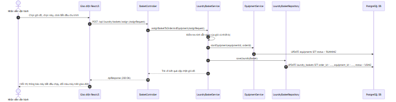

*Hình 2.14: Biểu đồ tuần tự - Gán giỏ đồ vào thiết bị*

---

### 2.2.7. Use Case 7: Vận hành Vòng đời đơn hàng & Cảnh báo SLA (State Machine)
*   **Mô tả**: Quản lý các trạng thái đơn hàng đi qua chu trình khép kín. Backend sử dụng Spring Statemachine kiểm soát chặt chẽ các bước chuyển trạng thái (Transitions) nhằm tránh chuyển sai luồng nghiệp vụ. Hệ thống tự động tính thời gian thực hiện ở từng trạng thái và đưa ra cảnh báo nhấp nháy 🚨 trên màn hình nếu vượt quá thời gian cam kết dịch vụ (SLA).

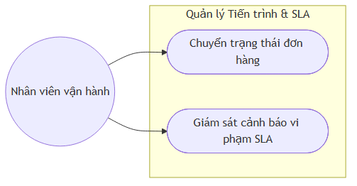

*Hình 2.15: Sơ đồ Use Case con - Vòng đời đơn hàng & SLA*

*   **Bảng kịch bản Use Case Chuyển trạng thái đơn hàng**:

| Thành phần | Đặc tả chi tiết |
| :--- | :--- |
| **Tên Use Case** | Chuyển trạng thái đơn hàng |
| **Tác nhân** | Nhân viên vận hành (Operator) |
| **Tiền điều kiện** | Đơn hàng tồn tại, bước chuyển trạng thái tuân thủ quy tắc máy trạng thái: `RECEIVED` -> `SORTING` -> `WASHING` -> `DRYING` -> `AWAITING_DELIVERY` -> `COMPLETED`. |
| **Hậu điều kiện** | Trạng thái đơn hàng được cập nhật, ghi bản ghi log vào bảng `order_state_logs` |
| **Luồng sự kiện chính** | 1. Nhân viên mở danh sách đơn hàng đang xử lý. 2. Nhấn nút chuyển bước cho đơn hàng (ví dụ: Từ `WASHING` sang `DRYING`). 3. Frontend gọi API PUT `/api/orders/{id}/status` kèm giá trị trạng thái đích. 4. Backend đưa đơn hàng qua máy trạng thái Spring Statemachine kiểm tra tính hợp lệ. 5. Nếu hợp lệ, cập nhật cột `status` trong bảng `orders`. Ghi lại mốc thời gian bắt đầu và kết thúc của trạng thái cũ, tính số phút xử lý thực tế lưu vào bảng `order_state_logs`. 6. Nếu chuyển trạng thái sang `AWAITING_DELIVERY` (chờ giao đồ), hệ thống tự động bật cờ để gửi thông báo cho nhân viên lưu kho. 7. Trả về kết quả thành công, cập nhật giao diện Timeline của đơn hàng. |
| **Luồng ngoại lệ** | - *Nhảy cóc trạng thái*: Ví dụ chuyển trực tiếp từ `RECEIVED` lên `DRYING` mà bỏ qua `SORTING` và `WASHING`, hệ thống máy trạng thái từ chối chuyển đổi, trả về lỗi 400 Bad Request "Chuyển đổi trạng thái không hợp lệ". |

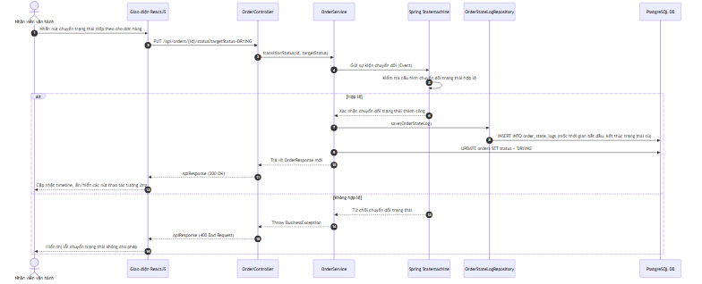

*Hình 2.16: Biểu đồ tuần tự - Chuyển trạng thái đơn hàng*

---

### 2.2.8. Use Case 8: Quản lý Lưu kho chờ trả đồ (Storage Rack Management)
*   **Mô tả**: Sau khi kết thúc chu trình sấy khô, nhân viên gấp quần áo, đóng gói và quét mã vạch đơn hàng để chọn vị trí kệ (kệ B, tầng 3) lưu trữ. Giúp việc tìm kiếm đồ khi khách đến nhận diễn ra nhanh chóng.

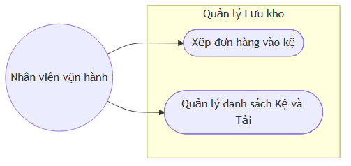

*Hình 2.17: Sơ đồ Use Case con - Lưu kho*

*   **Bảng kịch bản Use Case Xếp đơn hàng vào kệ**:

| Thành phần | Đặc tả chi tiết |
| :--- | :--- |
| **Tên Use Case** | Xếp đơn hàng vào kệ (Assign Rack) |
| **Tác nhân** | Nhân viên vận hành (Operator) |
| **Tiền điều kiện** | Đơn hàng ở trạng thái `AWAITING_DELIVERY`, kệ lưu kho tồn tại và có sức chứa trống |
| **Hậu điều kiện** | Đơn hàng được gắn ID kệ, trạng thái kệ cập nhật tải thực tế |
| **Luồng sự kiện chính** | 1. Nhân viên mang giỏ đồ đã hoàn thành đến khu vực kệ lưu kho. 2. Trên giao diện màn hình Lưu kho, nhân viên chọn mã đơn hàng hoặc quét mã đơn hàng. 3. Chọn một ô kệ đang còn trống (Ví dụ: Kệ A - Tầng 2). 4. Nhấn "Lưu vị trí". 5. Frontend gửi yêu cầu PUT `/api/orders/{id}/storage-rack` kèm ID của kệ. 6. Backend cập nhật `storage_rack_id` trong bảng `orders`. Tính toán lại số lượng đơn hàng đang lưu trữ trên kệ đó. 7. Trả về kết quả thành công, vị trí kệ được in đậm trên thông tin đơn hàng giúp việc tìm kiếm đồ sau này dễ dàng hơn. |

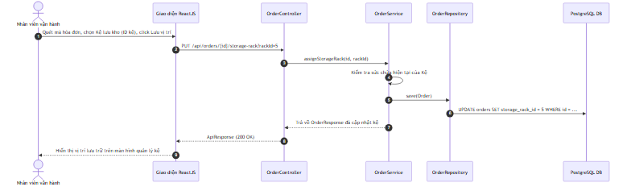

*Hình 2.18: Biểu đồ tuần tự - Xếp đơn hàng vào kệ*

---

### 2.2.9. Use Case 9: Quản lý Khách hàng (Customer Management)
*   **Mô tả**: Hệ thống quản lý hồ sơ khách hàng thành viên bao gồm thông tin liên hệ, lịch sử sử dụng dịch vụ và doanh thu tích lũy. Nhân viên có thể tìm kiếm nhanh bằng tên hoặc số điện thoại khi tiếp nhận đơn hàng mới.

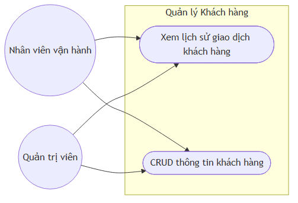

*Hình 2.19: Sơ đồ Use Case con - Quản lý Khách hàng*

*   **Bảng kịch bản Use Case Xem lịch sử giao dịch khách hàng**:

| Thành phần | Đặc tả chi tiết |
| :--- | :--- |
| **Tên Use Case** | Xem lịch sử giao dịch khách hàng |
| **Tác nhân** | Nhân viên vận hành, Quản trị viên |
| **Tiền điều kiện** | Khách hàng đã có hồ sơ trong hệ thống (bảng `customers`) |
| **Hậu điều kiện** | Hiển thị đầy đủ danh sách các đơn hàng đã tạo, tổng chi tiêu và tần suất sử dụng dịch vụ của khách |
| **Luồng sự kiện chính** | 1. Người dùng vào menu "Khách hàng". 2. Tìm kiếm tên hoặc SĐT khách hàng. 3. Nhấn vào tên khách hàng để xem chi tiết. 4. Frontend gọi API GET `/api/customers/{id}/history`. 5. Backend truy xuất các đơn hàng liên kết với `customer_id` này trong bảng `orders`. Tính tổng tiền chi tiêu tích lũy. 6. Trả về thông tin khách hàng kèm danh sách chi tiết đơn hàng. 7. Giao diện hiển thị biểu đồ thống kê đơn hàng và danh sách hóa đơn tương ứng. |

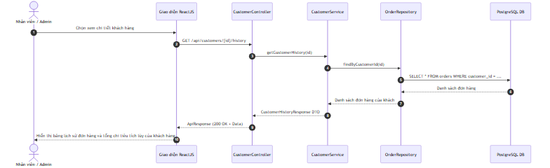

*Hình 2.20: Biểu đồ tuần tự - Xem lịch sử giao dịch khách hàng*

---

### 2.2.10. Use Case 10: Thanh toán & Giao nhận trả đồ (Delivery & Payment)
*   **Mô tả**: Nhân viên thực hiện thu tiền đơn hàng (ghi nhận phương thức CASH hoặc BANK_TRANSFER), cập nhật trạng thái thanh toán sang `PAID`, giải phóng vị trí kệ lưu trữ và cập nhật trạng thái đơn hàng thành `COMPLETED` để hoàn tất bàn giao quần áo cho khách hàng.

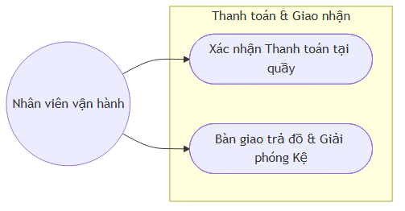

*Hình 2.21: Sơ đồ Use Case con - Thanh toán & Giao nhận*

*   **Bảng kịch bản Use Case Bàn giao trả đồ & Giải phóng Kệ**:

| Thành phần | Đặc tả chi tiết |
| :--- | :--- |
| **Tên Use Case** | Bàn giao trả đồ & Giải phóng Kệ |
| **Tác nhân** | Nhân viên vận hành (Operator) |
| **Tiền điều kiện** | Đơn hàng đã ở trạng thái `AWAITING_DELIVERY` và trạng thái thanh toán là `PAID` |
| **Hậu điều kiện** | Đơn hàng cập nhật trạng thái `COMPLETED`. Giải phóng vị trí lưu trữ trên kệ (storage_rack_id = null). |
| **Luồng sự kiện chính** | 1. Khách hàng đọc mã hóa đơn hoặc số điện thoại tại quầy. 2. Nhân viên tìm kiếm trên giao diện Lưu kho / Bàn giao trả hàng, hệ thống chỉ ra vị trí kệ lưu đồ. 3. Nhân viên lấy đồ từ kệ trao cho khách, kiểm tra trạng thái thanh toán đã là `PAID`. Nếu chưa thanh toán, thực hiện thanh toán trước. 4. Nhấn nút "Hoàn thành & Giao đồ" (Deliver). 5. Giao diện gọi API POST `/api/orders/{id}/deliver`. 6. Backend cập nhật `status` của đơn hàng sang `COMPLETED`, xóa liên kết `storage_rack_id` (thiết lập thành `NULL` trong bảng `orders`), đồng thời lưu mốc thời gian giao nhận vào cột `delivered_at` và tên nhân viên giao vào `delivered_by`. 7. Trả về kết quả thành công, giải phóng tải của kệ tương ứng. |

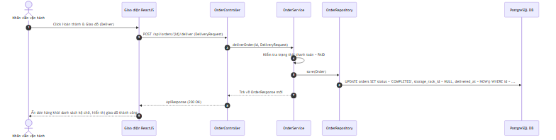

*Hình 2.22: Biểu đồ tuần tự - Bàn giao trả đồ & Giải phóng kệ*

---

### 2.2.11. Use Case 11: Dashboard & Báo cáo doanh thu phân tích hiệu suất (Reports)
*   **Mô tả**: Cung cấp số liệu thống kê cho Admin về doanh thu theo khoảng thời gian, tỷ trọng các dịch vụ, hiệu suất hoạt động của các thiết bị máy giặt/sấy và kết xuất dữ liệu thống kê ra file Excel thông qua Apache POI.

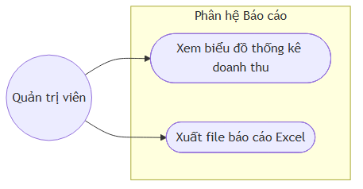

*Hình 2.23: Sơ đồ Use Case con - Báo cáo*

*   **Bảng kịch bản Use Case Xuất file báo cáo Excel**:

| Thành phần | Đặc tả chi tiết |
| :--- | :--- |
| **Tên Use Case** | Xuất file báo cáo Excel (Apache POI) |
| **Tác nhân** | Quản trị viên (Admin) |
| **Tiền điều kiện** | Admin đã đăng nhập hệ thống và có quyền `REPORT:EXPORT` |
| **Hậu điều kiện** | Xuất và tải xuống tệp tin Excel chứa dữ liệu thô và các định dạng báo cáo chuỗi cửa hàng |
| **Luồng sự kiện chính** | 1. Admin vào trang Dashboard, chọn khoảng thời gian cần thống kê. 2. Nhấn nút "Xuất báo cáo Excel". 3. Giao diện gửi yêu cầu GET `/api/reports/export?startDate=...&endDate=...` nhận dữ liệu luồng nhị phân (binary stream). 4. Backend xử lý yêu cầu, lấy danh sách đơn hàng đã hoàn thành trong khoảng thời gian chỉ định từ CSDL. 5. Sử dụng thư viện **Apache POI** khởi tạo workbook Excel mới, tạo sheet báo cáo, ghi các dòng dữ liệu tiêu đề và dữ liệu chi tiết đơn hàng (Mã đơn, Tên khách, Ngày tạo, Tổng tiền, Trạng thái thanh toán). 6. Thiết lập các ô tính toán tổng cộng và áp dụng font chữ, màu nền chuyên nghiệp cho bảng tính. 7. Ghi dòng dữ liệu nhị phân vào HTTP Response Output Stream kèm Content-Disposition header chỉ định tên file. 8. Trình duyệt của Admin tự động nhận diện và tải xuống file Excel báo cáo. |

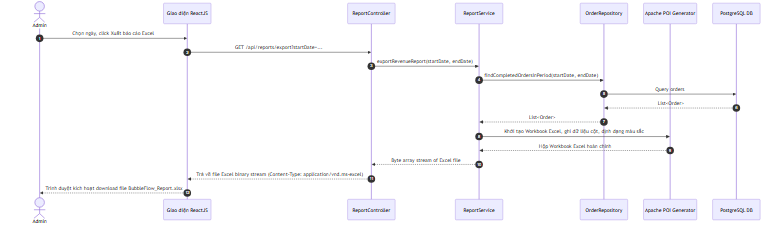

*Hình 2.24: Biểu đồ tuần tự - Xuất báo cáo Excel*

---

## 2.3. Phân tích các yêu cầu phi chức năng

Hệ thống BubbleFlow bên cạnh việc đáp ứng đầy đủ quy trình nghiệp vụ cần tuân thủ nghiêm ngặt các tiêu chuẩn kỹ thuật phi chức năng (Non-Functional Requirements - NFRs) để hoạt động hiệu quả trên thực tế:

1.  **Hiệu năng và Tải trang (Performance & Load Time)**:
    *   Thời gian phản hồi (Response Time) của các API nghiệp vụ cốt lõi (tiếp nhận đơn hàng, đổi trạng thái) phải dưới **200ms** trong điều kiện mạng bình thường.
    *   Hỗ trợ cơ chế tải trang nhanh cho giao diện SPA nhờ kỹ thuật **Code Splitting** (React.lazy + Suspense), đảm bảo kích thước bundle ban đầu nhỏ để tải trang đăng nhập trong vòng dưới **1.5 giây**.
    *   Dữ liệu tĩnh và cấu hình hệ thống (như danh sách các gói dịch vụ, thông tin máy móc) được lưu trên **Redis Cache** với cơ chế xóa cache tự động khi cập nhật (Write-through / Cache Eviction), giảm thiểu truy vấn trực tiếp đến PostgreSQL giúp tối ưu hóa luồng tải.

2.  **Tính bảo mật của thông tin xác thực (JWT & API Security)**:
    *   Mã hóa toàn bộ mật khẩu người dùng lưu trong cơ sở dữ liệu bằng thuật toán **BCrypt** với độ phức tạp (Strength) là 12 vòng băm.
    *   Xác thực API không trạng thái qua Access Token JWT có thời hạn hết hạn 15 phút, được đính kèm vào Authorization Header dưới dạng `Bearer Token`. Refresh Token lưu trong DB được mã hóa ngẫu nhiên, giúp ngăn chặn nguy cơ đánh cắp phiên.
    *   Bộ lọc phân quyền động đối chiếu IP, quyền hạn người dùng trước khi định tuyến API để tránh các lỗi leo thang đặc quyền (Privilege Escalation).

3.  **Khả năng chịu lỗi và Tính sẵn sàng (Availability & Fault Tolerance)**:
    *   Kiến trúc Stateless Backend cho phép dễ dàng nhân rộng số lượng instance (Horizontally Scalable) phía sau một bộ cân bằng tải (Load Balancer) trong tương lai mà không cần cấu hình lại bộ nhớ phiên.
    *   Các thay đổi cấu trúc CSDL được triển khai bằng **Flyway Migration**, đảm bảo tính đồng bộ dữ liệu tuyệt đối giữa các môi trường chạy thử và môi trường vận hành thực tế.

4.  **Trải nghiệm người dùng và Giao diện trực quan (UI/UX Usability)**:
    *   Giao diện thiết kế theo triết lý hiện đại với màu sắc Indigo/Cyan dễ chịu cho nhân viên khi làm việc lâu trước màn hình.
    *   Tích hợp bộ hiển thị Steps tiến độ trực quan ngay trên mỗi dòng đơn hàng, giúp nhân viên không cần click mở nhiều tab vẫn biết được đơn đồ đang ở giai đoạn giặt hay sấy.
    *   Cảnh báo vi phạm cam kết SLA được thiết kế nhấp nháy màu đỏ 🚨 kết hợp âm thanh thông báo nhẹ giúp tăng sự tập trung của nhân viên vào các đơn hàng bị trễ hạn xử lý.

---

## 2.4. Thiết kế Cơ sở dữ liệu

### 2.4.1. Danh sách các bảng dữ liệu & Thuộc tính chi tiết
Hệ thống sử dụng cơ sở dữ liệu quan hệ PostgreSQL gồm 18 bảng. Dưới đây là chi tiết các thuộc tính và kiểu dữ liệu:

1.  **`users`** (Quản lý tài khoản hệ thống)
    *   `id` (BIGSERIAL, PK): Khóa chính.
    *   `username` (VARCHAR(50), Unique, Not Null): Tên đăng nhập.
    *   `email` (VARCHAR(100), Unique, Not Null): Email liên hệ.
    *   `password` (VARCHAR(255), Not Null): Mật khẩu đã băm (BCrypt).
    *   `full_name` (VARCHAR(100)): Họ và tên.
    *   `phone` (VARCHAR(20)): Số điện thoại.
    *   `avatar_url` (VARCHAR(255)): Link ảnh đại diện.
    *   `is_active` (BOOLEAN, Not Null, Default True): Trạng thái kích hoạt.
    *   *Các trường Audit của BaseEntity* (`created_at`, `updated_at`, `created_by`, `updated_by`, `version`).

2.  **`roles`** (Bảng quản lý vai trò)
    *   `id` (BIGSERIAL, PK): Khóa chính.
    *   `name` (VARCHAR(50), Unique, Not Null): Tên vai trò (Vd: ROLE_ADMIN, ROLE_STAFF).
    *   `description` (VARCHAR(255)): Mô tả vai trò.
    *   `type` (VARCHAR(20), Not Null, Default 'CUSTOM'): Loại vai trò (ALL - Toàn quyền, CUSTOM - Tùy chỉnh).

3.  **`permissions`** (Quyền truy cập API chi tiết)
    *   `id` (BIGSERIAL, PK): Khóa chính.
    *   `name` (VARCHAR(100), Unique, Not Null): Mã quyền (Vd: ORDER:CREATE, EQUIPMENT:UPDATE).
    *   `description` (VARCHAR(255)): Mô tả quyền truy cập.
    *   `api_path` (VARCHAR(255), Not Null): URL API tương ứng.
    *   `api_method` (VARCHAR(10), Not Null): Phương thức HTTP (GET, POST, PUT, DELETE).
    *   `controller_name` (VARCHAR(100), Not Null): Tên Controller để gom nhóm hiển thị.

4.  **`role_permissions`** (Bảng trung gian n-n nối vai trò và quyền hạn)
    *   `role_id` (BIGINT, FK references roles): Khóa ngoại nối bảng roles.
    *   `permission_id` (BIGINT, FK references permissions): Khóa ngoại nối bảng permissions.
    *   *PK là cặp (role_id, permission_id)*.

5.  **`user_roles`** (Bảng trung gian n-n nối người dùng và vai trò)
    *   `user_id` (BIGINT, FK references users): Khóa ngoại nối bảng users.
    *   `role_id` (BIGINT, FK references roles): Khóa ngoại nối bảng roles.
    *   *PK là cặp (user_id, role_id)*.

6.  **`refresh_tokens`** (Quản lý phiên làm việc lâu dài)
    *   `id` (BIGSERIAL, PK): Khóa chính.
    *   `token` (VARCHAR(255), Unique, Not Null): Mã token ngẫu nhiên dạng chuỗi.
    *   `user_id` (BIGINT, FK references users): Chủ sở hữu token.
    *   `expiry_date` (TIMESTAMP, Not Null): Hạn hết hạn token.

7.  **`customers`** (Quản lý thông tin khách hàng thành viên)
    *   `id` (BIGSERIAL, PK): Khóa chính.
    *   `full_name` (VARCHAR(150), Not Null): Họ tên khách hàng.
    *   `phone` (VARCHAR(20), Unique, Not Null): Số điện thoại duy nhất.
    *   `email` (VARCHAR(100)): Email của khách hàng.
    *   `address` (TEXT): Địa chỉ liên hệ.
    *   `total_spent` (NUMERIC(12, 2), Default 0.00): Tổng tiền tích lũy.

8.  **`services`** (Danh mục gói dịch vụ và bảng giá)
    *   `id` (BIGSERIAL, PK): Khóa chính.
    *   `service_code` (VARCHAR(50), Unique, Not Null): Mã dịch vụ (Vd: WASH_KG, DRY_KG, DRY_CLEAN_SUIT).
    *   `name` (VARCHAR(150), Not Null): Tên gói dịch vụ.
    *   `description` (TEXT): Mô tả chi tiết dịch vụ.
    *   `pricing_type` (VARCHAR(50), Not Null): Hình thức tính giá (BY_WEIGHT - theo kg, BY_ITEM - theo món).
    *   `unit_price` (NUMERIC(12,2), Not Null): Đơn giá gốc.
    *   `sla_hours` (INTEGER, Not Null, Default 4): Thời gian xử lý cam kết (số giờ tối đa).

9.  **`equipments`** (Thông số quản lý thiết bị máy giặt/sấy)
    *   `id` (BIGSERIAL, PK): Khóa chính.
    *   `equipment_code` (VARCHAR(50), Unique, Not Null): Mã số máy.
    *   `name` (VARCHAR(100), Not Null): Tên máy.
    *   `type` (VARCHAR(50), Not Null): Loại máy (WASHER - Máy giặt, DRYER - Máy sấy).
    *   `capacity` (VARCHAR(50)): Công suất tải (Ví dụ: 10kg, 15kg).
    *   `status` (VARCHAR(50), Default 'IDLE'): Trạng thái máy (IDLE, RUNNING, MAINTENANCE).
    *   `accumulated_hours` (NUMERIC(10,2), Default 0.00): Số giờ chạy tích lũy.
    *   `usage_count` (INTEGER, Default 0): Tổng số lượt giặt sấy đã chạy.

10. **`orders`** (Quản lý thông tin đơn hàng cốt lõi)
    *   `id` (BIGSERIAL, PK): Khóa chính.
    *   `order_code` (VARCHAR(50), Unique, Not Null): Mã hóa đơn.
    *   `customer_name` (VARCHAR(150), Not Null): Tên khách hàng (lưu trực tiếp để in hóa đơn nhanh).
    *   `customer_phone` (VARCHAR(20), Not Null): SĐT khách hàng.
    *   `total_amount` (NUMERIC(12,2), Default 0.00): Tổng giá trị thanh toán.
    *   `status` (VARCHAR(50), Default 'RECEIVED'): Trạng thái vòng đời (RECEIVED, SORTING, WASHING, DRYING, AWAITING_DELIVERY, COMPLETED).
    *   `payment_status` (VARCHAR(50), Default 'UNPAID'): Trạng thái thanh toán (UNPAID, PAID).
    *   `payment_method` (VARCHAR(50)): Phương thức thanh toán (CASH, BANK_TRANSFER).
    *   `delivery_type` (VARCHAR(50), Default 'PICKUP'): Hình thức giao hàng (PICKUP, SHIPPER).
    *   `shipper_name` (VARCHAR(150)): Họ tên shipper nếu gửi hàng.
    *   `shipper_phone` (VARCHAR(50)): SĐT shipper.
    *   `delivered_at` (TIMESTAMP): Thời điểm giao trả đồ hoàn tất.
    *   `delivered_by` (VARCHAR(100)): Tên nhân viên giao trả đồ.
    *   `customer_id` (BIGINT, FK references customers): Liên kết khách hàng thành viên.
    *   `storage_rack_id` (BIGINT, FK references storage_racks): Kệ đang lưu giữ đồ chờ giao.
    *   `customer_notified` (BOOLEAN, Default False): Đã gửi thông báo cho khách đồ xong chưa.
    *   `notified_at` (TIMESTAMP): Thời gian gửi thông báo đồ xong.
    *   `notes` (TEXT): Ghi chú đồ bẩn (Vd: rách gấu, ố vàng vết bẩn trước khi giặt).

11. **`order_items`** (Chi tiết các gói dịch vụ trong một đơn hàng)
    *   `id` (BIGSERIAL, PK): Khóa chính.
    *   `order_id` (BIGINT, FK references orders, Not Null): Liên kết đơn hàng.
    *   `service_id` (BIGINT, FK references services, Not Null): Liên kết dịch vụ.
    *   `quantity` (NUMERIC(10,2), Not Null): Số lượng (Số kg cân hoặc số món đồ).
    *   `unit_price` (NUMERIC(12,2), Not Null): Đơn giá tại thời điểm tạo đơn.
    *   `subtotal` (NUMERIC(12,2), Not Null): Thành tiền của dòng.
    *   `notes` (TEXT): Ghi chú riêng cho món đồ.

12. **`laundry_baskets`** (Quản lý giỏ đồ vật lý để điều phối)
    *   `id` (BIGSERIAL, PK): Khóa chính.
    *   `basket_code` (VARCHAR(50), Unique, Not Null): Mã giỏ đồ.
    *   `name` (VARCHAR(100)): Tên mô tả giỏ.
    *   `order_id` (BIGINT, FK references orders): Đơn hàng đang được đặt trong giỏ.
    *   `equipment_id` (BIGINT, FK references equipments): Thiết bị mà giỏ đồ này đang nằm trong (giỏ đang giặt trong máy X).
    *   `status` (VARCHAR(50), Default 'IDLE'): Trạng thái giỏ đồ (IDLE - Rảnh, USING - Đang sử dụng).

13. **`order_state_logs`** (Ghi nhật ký lịch sử trạng thái phục vụ tính toán SLA)
    *   `id` (BIGSERIAL, PK): Khóa chính.
    *   `order_id` (BIGINT, FK references orders, Not Null): Đơn hàng tương ứng.
    *   `from_state` (VARCHAR(50)): Trạng thái cũ.
    *   `to_state` (VARCHAR(50), Not Null): Trạng thái mới.
    *   `transitioned_at` (TIMESTAMP, Not Null): Thời điểm chuyển trạng thái.
    *   `operator` (VARCHAR(100)): Tên nhân viên bấm thực hiện chuyển đổi.

14. **`storage_racks`** (Danh mục kệ chứa quần áo hoàn thành chờ trả đồ)
    *   `id` (BIGSERIAL, PK): Khóa chính.
    *   `rack_code` (VARCHAR(50), Unique, Not Null): Mã số kệ (Ví dụ: RACK_A, RACK_B).
    *   `name` (VARCHAR(100)): Tên kệ.
    *   `capacity` (INTEGER, Not Null, Default 10): Số lượng đơn hàng tối đa có thể xếp vừa kệ.
    *   `current_load` (INTEGER, Default 0): Số lượng đơn hàng thực tế đang nằm trên kệ.

15. **`equipment_usage_logs`** (Nhật ký chạy máy chi tiết để tính thời gian chạy thực tế)
    *   `id` (BIGSERIAL, PK): Khóa chính.
    *   `equipment_id` (BIGINT, FK references equipments, Not Null): Máy sử dụng.
    *   `order_id` (BIGINT, FK references orders, Not Null): Đơn hàng giặt sấy.
    *   `start_time` (TIMESTAMP, Not Null): Giờ bắt đầu ấn nút chạy.
    *   `end_time` (TIMESTAMP): Giờ kết thúc thực tế hoặc dự kiến.
    *   `run_duration_minutes` (INTEGER): Tổng số phút chạy thực tế của chu kỳ.

16. **`system_settings`** (Bảng cấu hình các thông số toàn cục hệ thống)
    *   `id` (BIGSERIAL, PK): Khóa chính.
    *   `key` (VARCHAR(100), Unique, Not Null): Khóa cài đặt (Vd: SLA_CHECK_INTERVAL_SEC, MAX_WEIGHT_PER_BASKET).
    *   `value` (TEXT, Not Null): Giá trị cài đặt.
    *   `description` (VARCHAR(255)): Mô tả tham số cấu hình.

17. **`notifications`** (Bảng lưu các thông báo hệ thống và cảnh báo SLA)
    *   `id` (BIGSERIAL, PK): Khóa chính.
    *   `title` (VARCHAR(150), Not Null): Tiêu đề thông báo.
    *   `content` (TEXT, Not Null): Chi tiết thông báo.
    *   `type` (VARCHAR(50), Not Null): Loại thông báo (SLA_WARNING, MACHINE_COMPLETED, SYSTEM).
    *   `is_read` (BOOLEAN, Not Null, Default False): Đánh dấu đã đọc.
    *   `user_id` (BIGINT, FK references users): Người nhận thông báo.
    *   `created_at` (TIMESTAMP, Default NOW()): Ngày tạo thông báo.

---

### 2.4.2. Mối quan hệ giữa các bảng trong hệ thống
Các mối quan hệ thực thể được thiết kế chặt chẽ và chuẩn hóa để tránh dư thừa dữ liệu:
*   **Mối quan hệ 1-n (Một - Nhiều)**:
    *   `users` - `refresh_tokens`: Một người dùng có thể có nhiều token phiên hoạt động trên các thiết bị khác nhau.
    *   `customers` - `orders`: Một khách hàng thành viên có thể tạo nhiều đơn hàng giặt sấy theo thời gian.
    *   `storage_racks` - `orders`: Một kệ hàng chứa được nhiều đơn hàng khác nhau cùng lúc. Khi giao đồ cho khách, trường `storage_rack_id` trên bảng `orders` sẽ set về `null` để giải phóng vị trí.
    *   `orders` - `order_items`: Một đơn hàng có thể chứa nhiều dòng chi tiết các gói dịch vụ giặt hoặc sấy khác nhau.
    *   `services` - `order_items`: Một dịch vụ giặt/sấy có thể xuất hiện trong nhiều dòng chi tiết của nhiều hóa đơn khác nhau.
    *   `orders` - `order_state_logs`: Một đơn hàng ghi nhận nhiều lần đổi trạng thái qua lại tạo thành một chuỗi nhật ký phục vụ báo cáo.
    *   `equipments` - `equipment_usage_logs`: Một thiết bị ghi nhận nhiều lượt giặt/sấy trong lịch sử hoạt động.
    *   `orders` - `equipment_usage_logs`: Một đơn hàng có thể được xử lý qua nhiều lượt (ví dụ: một lượt máy giặt và một lượt máy sấy).
    *   `users` - `notifications`: Một người dùng hệ thống có thể nhận nhiều thông báo và cảnh báo từ hệ thống.

*   **Mối quan hệ n-n (Nhiều - Nhiều)**:
    *   `users` - `roles`: Một người dùng có thể gán nhiều vai trò, một vai trò chứa nhiều người dùng. Mối quan hệ n-n này được giải quyết thông qua bảng liên kết trung gian `user_roles`.
    *   `roles` - `permissions`: Một vai trò chứa nhiều quyền hạn truy cập API, một quyền truy cập API có thể gán cho nhiều vai trò. Giải quyết bằng bảng trung gian `role_permissions`.

*   **Mối quan hệ 1-1 (Một - Một) dạng tùy chọn hoặc 1-n tùy chỉnh**:
    *   `orders` - `laundry_baskets`: Tại một thời điểm vận hành vật lý, một đơn hàng chỉ được gán chứa trong một giỏ đồ duy nhất, và một giỏ đồ chỉ chứa quần áo của một đơn hàng để tránh nhầm lẫn đồ của khách. Mối quan hệ được duy trì thông qua trường `order_id` (nullable) trên bảng `laundry_baskets`.

---

### 2.4.3. Biểu đồ quan hệ thực thể ERD
Dưới đây là sơ đồ ERD tổng thể của hệ thống BubbleFlow thể hiện mối liên kết giữa các thực thể trong cơ sở dữ liệu:

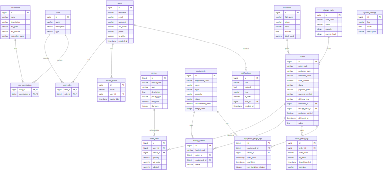

*Hình 2.25: Sơ đồ thực thể liên kết (ERD) cơ sở dữ liệu BubbleFlow*

---

## 2.5. Kết luận Chương 2

Chương 2 đã cung cấp một bản thiết kế chi tiết và toàn diện cho hệ thống **BubbleFlow**. Từ việc xác định kiến trúc 3 tầng phân tách rõ ràng, mô tả vai trò của các tác nhân (Khách hàng, Nhân viên, Admin), chương này đã đi sâu đặc tả kỹ lưỡng 11 kịch bản Use Case nghiệp vụ cốt lõi hoạt động của hệ thống kèm theo các sơ đồ tuần tự (Sequence Diagram) tương ứng thể hiện dòng chảy dữ liệu từ Giao diện ReactJS qua các Controller, Service, Repository đến Cơ sở dữ liệu PostgreSQL. Các yêu cầu phi chức năng cũng được phân tích đầy đủ để làm thước đo hiệu năng thực tế. Cuối cùng, thiết kế cơ sở dữ liệu với 18 bảng cấu trúc dữ liệu chuẩn hóa và sơ đồ quan hệ thực thể ERD chi tiết chính là cơ sở vật lý vững chắc để chúng ta triển khai mã nguồn và tiến hành thử nghiệm hệ thống trong Chương 3.
