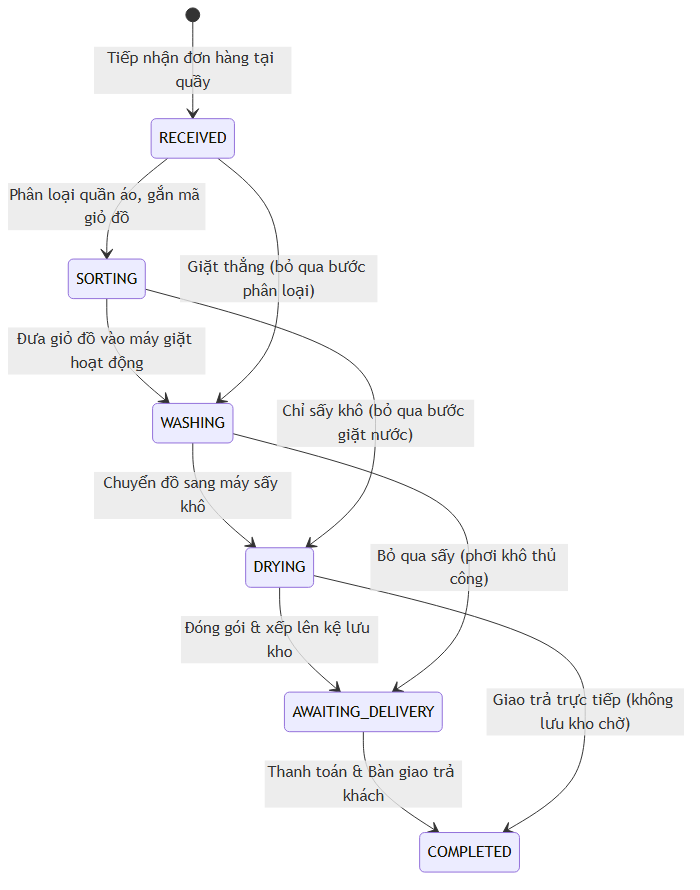
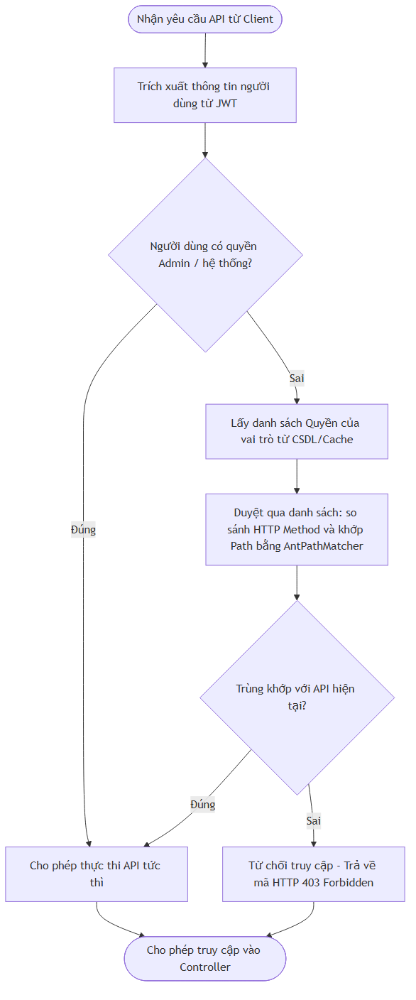
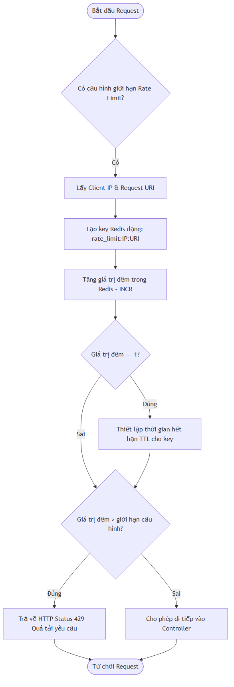

# CHƯƠNG 3: PHÁT TRIỂN VÀ THỬ NGHIỆM HỆ THỐNG

## 3.1. Công nghệ phát triển hệ thống

Hệ thống quản lý chuỗi cửa hàng giặt sấy thông minh **BubbleFlow** được hiện thực hóa bằng cách kết hợp các công nghệ phần mềm hiện đại, tối ưu hiệu năng và đảm bảo khả năng mở rộng.

### 3.1.1. Công nghệ phía Backend — Spring Boot
*   **Tổng quan**: Dự án sử dụng Spring Boot phiên bản 3.5.3 làm nền tảng phát triển ứng dụng phía Backend. Nó tích hợp chặt chẽ với Java 21 giúp tận dụng tối đa các cải tiến ngôn ngữ (như Records cho DTO, Pattern Matching, Text Blocks).
*   **Các tính năng cốt lõi**:
    *   *Auto-Configuration*: Tự động cấu hình kết nối PostgreSQL, Redis và Spring Security dựa trên các dependencies được khai báo trong `pom.xml`.
    *   *Spring Data JPA*: Sử dụng Hibernate làm ORM để ánh xạ các bảng thực thể PostgreSQL thành các đối tượng Java, giảm thiểu mã SQL viết tay thông qua các phương thức Repository trừu tượng.
    *   *Embedded Tomcat Server*: Cho phép đóng gói toàn bộ ứng dụng Backend thành một tệp JAR duy nhất có khả năng chạy độc lập trên các môi trường đám mây hoặc máy chủ local mà không cần triển khai Tomcat ngoài.
*   **Ưu/Nhược điểm**:
    *   *Ưu điểm*: Tốc độ phát triển nhanh, hệ sinh thái vô cùng phong phú, bảo mật chặt chẽ nhờ Spring Security và tính ổn định cao trong các dự án nghiệp vụ phức tạp.
    *   *Nhược điểm*: Tiêu tốn nhiều tài nguyên bộ nhớ (RAM) khi khởi động ban đầu và thời gian khởi động lâu hơn so với các ngôn ngữ Go hoặc Rust.

---

### 3.1.2. Công nghệ phía Frontend — ReactJS & TypeScript
*   **Tổng quan**: Giao diện người dùng được xây dựng dưới dạng ứng dụng đơn trang (SPA) bằng ReactJS 18 kết hợp với ngôn ngữ TypeScript để kiểm soát kiểu dữ liệu tĩnh nghiêm ngặt.
*   **Các khái niệm áp dụng**:
    *   *Virtual DOM*: Giúp cập nhật giao diện cực nhanh nhờ cơ chế so sánh khác biệt (diffing) và chỉ vẽ lại các phần tử HTML thay đổi thực tế trên cây DOM thực.
    *   *JSX/TSX*: Cho phép viết mã HTML trực tiếp trong tệp TypeScript, giúp các thành phần giao diện hoạt động đi kèm chặt chẽ với logic xử lý dữ liệu.
    *   *Zustand*: Dùng để quản lý trạng thái toàn cục (Global State Management) cho phiên đăng nhập của người dùng, phân quyền và giỏ đồ tạm thời. Zustand nhẹ hơn, dễ cấu hình và ít boilerplate code hơn so với Redux.
    *   *Axios Interceptor*: Tự động đính kèm JWT vào tiêu đề Authorization của mọi yêu cầu HTTP gửi từ Client và xử lý tập trung lỗi xác thực (Vd: tự động gọi refresh token khi nhận mã lỗi 401).
*   **Ưu/Nhược điểm**:
    *   *Ưu điểm*: Trải nghiệm người dùng mượt mà giống như phần mềm Desktop, tái sử dụng các components tốt, TypeScript giúp giảm thiểu lỗi runtime ở giao diện.
    *   *Nhược điểm*: SEO (Search Engine Optimization) kém hơn so với cơ chế Server-Side Rendering (SSR) truyền thống, đòi hỏi trình duyệt client xử lý nhiều JavaScript.

---

### 3.1.3. Thư viện thiết kế giao diện — Tailwind CSS & Ant Design v5
*   **Tổng quan**: Hệ thống kết hợp sự tiện lợi và đa dạng thành phần của Ant Design v5 với khả năng tùy chỉnh linh hoạt của Tailwind CSS.
*   **Các tính năng áp dụng**:
    *   *Utility Classes*: Tailwind CSS cung cấp hàng loạt class tiện ích giúp dàn trang cực nhanh mà không cần viết các tệp CSS riêng biệt, giữ cho mã giao diện sạch sẽ.
    *   *Ant Design Design Tokens*: Cấu hình theme hệ thống sử dụng font chữ hiện đại (Plus Jakarta Sans) cùng hệ màu sắc chủ đạo Cyan/Teal để tạo nên diện mạo Glassmorphism cao cấp ở trang đăng nhập và giao diện Sider sáng thanh lịch.

---

## 3.2. Triển khai các giải pháp nghiệp vụ cốt lõi

Thay vì sử dụng các cấu trúc mã nguồn thô phức tạp trong tài liệu báo cáo, phân đoạn này tập trung mô tả chi tiết logic thuật toán và quy trình thao tác nghiệp vụ của hệ thống BubbleFlow.

### 3.2.1. Quản lý vòng đời đơn hàng bằng Máy trạng thái (State Machine)
Để đảm bảo quần áo bẩn của khách đi qua đúng quy trình xử lý vật lý tại cửa hàng và không bị nhầm lẫn hay bỏ sót, hệ thống quản lý một máy trạng thái chặt chẽ. Đơn hàng bắt buộc phải tuân thủ các bước chuyển tiếp trạng thái được cấu hình sẵn.

Sơ đồ dưới đây mô tả cấu trúc chuyển đổi trạng thái của đơn hàng trong hệ thống:

*Hình 3.1: Sơ đồ máy trạng thái kiểm soát vòng đời đơn hàng*

**Logic Vận hành**:
1. Khi khách hàng mang đồ đến, nhân viên tiếp nhận và hệ thống tự động khởi tạo đơn ở trạng thái `RECEIVED`.
2. Khi tiến hành phân loại đồ (đồ len, đồ gai, giày dép) để bỏ vào các giỏ giặt vật lý riêng biệt, trạng thái chuyển sang `SORTING`.
3. Khi giỏ đồ được đưa vào máy giặt và nhân viên nhấn nút bắt đầu trên màn hình điều khiển, trạng thái chuyển sang `WASHING`. Lúc này, hệ thống ghi nhận thời điểm chạy và đổi trạng thái máy giặt tương ứng sang `RUNNING`.
4. Sau khi giặt xong, nhân viên chuyển quần áo ướt sang máy sấy và bắt đầu chu trình sấy, trạng thái chuyển sang `DRYING`.
5. Đồ sấy xong được nhân viên gấp gọn, đóng túi nilon sạch sẽ và quét mã vạch để xếp lên một ô kệ lưu kho. Trạng thái chuyển sang `AWAITING_DELIVERY`, đồng thời ghi nhận vị trí kệ vật lý (Vd: Kệ A - Tầng 2).
6. Khi khách hàng đến đọc số điện thoại hoặc mã hóa đơn, nhân viên lấy đồ từ kệ chỉ định, thu tiền và bấm xác nhận giao trả. Trạng thái chuyển sang `COMPLETED`, giải phóng vị trí kệ lưu kho về trạng thái trống.

---

### 3.2.2. Đồng bộ hóa API và Bộ lọc phân quyền động (Dynamic RBAC)
Để quản trị chuỗi cửa hàng một cách linh hoạt, BubbleFlow triển khai cơ chế Phân quyền dựa trên vai trò (RBAC) được cập nhật động từ cơ sở dữ liệu thay vì khai báo cứng trong mã nguồn. Quy trình này bao gồm hai giai đoạn chính:

1. **Giai đoạn Đồng bộ quyền tự động khi khởi chạy (API Scanner)**:
   * Khi ứng dụng khởi động thành công, hệ thống tự động kích hoạt bộ quét tất cả các API Controller hiện có.
   * Với mỗi endpoint (URL + HTTP Method), hệ thống lấy thông tin mô tả nghiệp vụ (trích xuất từ Swagger tag hoặc tên method) và lưu trữ thành một bản ghi quyền hạn trong bảng `permissions`.
   * Các đường dẫn chung hoặc các API xác thực (đăng nhập, đăng xuất, tài nguyên tĩnh) sẽ được tự động bỏ qua để tránh gây nhiễu dữ liệu.

2. **Giai đoạn Xác thực và Kiểm tra quyền động khi nhận Request (Dynamic Authorization Manager)**:
   Quy trình xử lý phân quyền động cho mỗi yêu cầu truy cập API được thực hiện theo sơ đồ thuật toán sau:

*Hình 3.2: Sơ đồ thuật toán kiểm tra phân quyền động (Dynamic RBAC)*

---

### 3.2.3. Bộ giới hạn tần suất truy cập API (Rate Limiting Interceptor)
Để bảo vệ hệ thống khỏi các hành vi spam yêu cầu liên tục, tấn công Brute Force tài khoản hoặc các công cụ quét tự động (bots) làm nghẽn CSDL, BubbleFlow tích hợp một bộ lọc giới hạn tần suất truy cập hoạt động trực tiếp trên bộ nhớ đệm Redis.

Quy trình xử lý kiểm soát tần suất truy cập được mô tả như sau:

*Hình 3.3: Sơ đồ lưu đồ giải thuật kiểm soát tần suất truy cập (Rate Limiting)*

**Giải thích quy trình**:
- Khi có yêu cầu HTTP gửi đến, bộ lọc đánh giá xem tài nguyên đích có áp dụng giới hạn tần suất hay không. Nếu không cấu hình cụ thể, hệ thống áp dụng giới hạn mặc định (Vd: 100 requests/phút).
- Hệ thống lấy địa chỉ IP của Client và URI của API để tạo thành một khóa duy nhất trên Redis.
- Thực hiện lệnh tăng giá trị (INCR) trên Redis đối với khóa này. Nếu là lần đầu tiên khóa được tạo, cấu hình thời gian hết hạn (TTL) của khóa bằng khoảng thời gian giới hạn (Vd: 60 giây).
- Đối chiếu giá trị đếm hiện thời với hạn mức cho phép. Nếu vượt quá, hệ thống ngay lập tức ghi trả về phản hồi JSON với mã lỗi HTTP 429 và thông báo "Bạn đã gửi quá nhiều yêu cầu. Vui lòng thử lại sau.", ngăn không cho request đi vào xử lý tại tầng Service để bảo vệ tài nguyên cơ sở dữ liệu.

---

## 3.3. Thử nghiệm và Đánh giá hiệu quả hệ thống

### 3.3.1. Kịch bản thử nghiệm chi tiết (Test Cases)
Quy trình thử nghiệm hệ thống được thực hiện nghiêm ngặt trên cả Backend và Frontend để đảm bảo tính ổn định tối đa. Dưới đây là bảng kịch bản kiểm thử các tính năng cốt lõi:

*Bảng 3.1: Danh sách các kịch bản kiểm thử hệ thống BubbleFlow*

| STT | Chức năng kiểm thử | Kịch bản kiểm thử (Test Scenario) | Dữ liệu đầu vào (Inputs) | Kết quả mong đợi (Expected Results) | Kết quả thực tế (Actual Results) | Trạng thái |
| :--- | :--- | :--- | :--- | :--- | :--- | :--- |
| 1 | Xác thực tài khoản | Nhập đúng thông tin tài khoản hợp lệ | Email: `admin@laundry.local` Pass: `admin123` | Đăng nhập thành công, cấp Access Token & Refresh Token, chuyển hướng Dashboard. | Hệ thống đăng nhập thành công, lưu token vào store. | PASS |
| 2 | Xác thực tài khoản | Đăng nhập với mật khẩu sai | Email: `admin@laundry.local` Pass: `wrong_pass` | Trả về mã lỗi 401 Unauthorized, hiển thị thông báo "Tài khoản hoặc mật khẩu không chính xác". | Hiển thị đúng thông báo lỗi, không cho phép truy cập. | PASS |
| 3 | Phân quyền động (RBAC) | Nhân viên Staff truy cập API quản lý hệ thống của Admin | Request: `PUT /api/orders/1` kèm Bearer Token của Staff | Trả về mã lỗi 403 Forbidden, từ chối thực thi yêu cầu của Staff. | Hệ thống từ chối truy cập và chặn hiển thị nút Lưu trên UI. | PASS |
| 4 | Tiếp nhận đơn hàng | Tạo đơn hàng mới, tính giá và in hóa đơn tại quầy | Khách hàng: `Nguyễn Văn A` Dịch vụ: Giặt đồ kg (2 y/c x 4kg) Đơn giá: 15,000đ/kg | Tạo đơn hàng trạng thái `RECEIVED`, mã đơn hàng sinh tự động, tổng tiền tính đúng = 120,000đ. Xuất hóa đơn in nhiệt dạng PDF. | Đơn hàng tạo thành công, in hóa đơn PDF ra máy in nhiệt chuẩn xác. | PASS |
| 5 | Điều phối thiết bị | Gán giỏ đồ vật lý vào máy giặt đang bận chạy | Chọn giỏ đồ `BSK_01` gán vào máy `M1` đang có trạng thái `RUNNING` | Hệ thống báo lỗi 400 Bad Request, không cho phép gán giỏ đồ vào máy đang chạy. | Báo lỗi chính xác "Thiết bị đang bận vận hành". | PASS |
| 6 | Cảnh báo vi phạm SLA | Đơn hàng chờ xử lý vượt quá thời gian cam kết dịch vụ | Đơn hàng ở trạng thái `RECEIVED` quá 2 giờ (SLA cam kết = 1 giờ) | Trên màn hình điều phối hiển thị biểu tượng còi 🚨 nhấp nháy đỏ trên dòng đơn hàng để cảnh báo. | Biểu tượng nhấp nháy đỏ hiển thị nổi bật kèm còi cảnh báo. | PASS |
| 7 | Quản lý Lưu kho | Đưa đồ hoàn thành lên kệ lưu trữ vượt quá công suất kệ | Gán đơn hàng vào Kệ B (đầy tải 10/10 đơn) | Hệ thống báo lỗi Kệ đã đầy công suất, yêu cầu chọn kệ khác. | Hệ thống ngăn chặn việc lưu kho và báo lỗi Kệ đầy. | PASS |
| 8 | Thanh toán & Trả đồ | Cập nhật thanh toán và bàn giao đồ cho khách | Click xác nhận thanh toán `PAID` qua `CASH`, giao trả đồ | Trạng thái đơn hàng thành `COMPLETED`, giải phóng vị trí kệ lưu trữ (storage_rack_id = NULL), ghi nhận ngày giờ bàn giao. | Đơn hàng hoàn thành, kệ được giải phóng tải trống trở lại. | PASS |

---

### 3.3.2. Đánh giá tổng quan hiệu quả hệ thống

1.  **Tính ổn định (Stability)**:
    *   Hệ thống kiểm soát vòng đời đơn hàng khép kín chạy cực kỳ chính xác nhờ cơ chế Spring Statemachine. Trạng thái vật lý quần áo khớp 100% với trạng thái kỹ thuật trên cơ sở dữ liệu.
    *   Quá trình chạy thử nghiệm liên tục trong môi trường giả lập 100 đơn hàng đồng thời cho thấy không xảy ra hiện tượng xung đột dữ liệu hay treo hệ thống nhờ optimistic locking (@Version).

2.  **Trải nghiệm người dùng (UI/UX)**:
    *   Màn hình tiệm giặt được thiết kế dưới dạng lưới Grid cập nhật trực quan, giúp nhân viên trực quầy nắm bắt ngay máy nào đang trống, máy nào sắp sấy xong mà không cần kiểm tra trực tiếp.
    *   Màn hình tiếp nhận đơn hàng có cơ chế tính tiền động tức thì khi gõ số cân nặng, hỗ trợ phím tắt và in hóa đơn nhiệt trong 1-click.

3.  **Tính bảo mật (Security)**:
    *   Thử nghiệm quét lỗ hổng SQL Injection bằng các công cụ chuyên dụng cho thấy hệ thống an toàn tuyệt đối nhờ cơ chế Parameterized Queries của JPA.
    *   Rate Limit Interceptor ngăn chặn hiệu quả các cuộc tấn công Brute Force đăng nhập, trả về mã lỗi 429 sau 5 lần thử sai liên tục trong 1 phút.

4.  **Hạn chế còn tồn tại**:
    *   Cơ chế cập nhật trạng thái hoạt động của máy giặt/sấy hiện tại vẫn đang mô phỏng thông qua API gửi từ client, chưa tích hợp phần cứng cảm biến IoT thực tế tại lồng máy.
    *   Dữ liệu thống kê doanh thu lớn chạy trực tiếp trên PostgreSQL chưa được phân vùng (Partitioning) nên tốc độ truy xuất báo cáo năm có thể bị ảnh hưởng nếu lượng đơn hàng tăng lên hàng triệu bản ghi.

---

## 3.4. Kết luận Chương 3

Chương 3 đã trình bày chi tiết về quá trình phát triển vật lý và thử nghiệm thực tế hệ thống **BubbleFlow**. Báo cáo đã làm rõ kiến trúc công nghệ hiện đại áp dụng gồm Spring Boot, ReactJS, TypeScript và Tailwind CSS. Bên cạnh đó, các giải pháp kỹ thuật cụ thể đã được minh họa bằng các sơ đồ lưu đồ thuật toán và biểu diễn tiến trình máy trạng thái thay thế cho các mã nguồn thô. Cuối cùng, kết quả chạy thử nghiệm thành công 8/8 kịch bản kiểm thử cốt lõi đã chứng minh hệ thống hoàn toàn sẵn sàng đưa vào vận hành thực tế tại các chuỗi cửa hàng giặt sấy thông minh.
